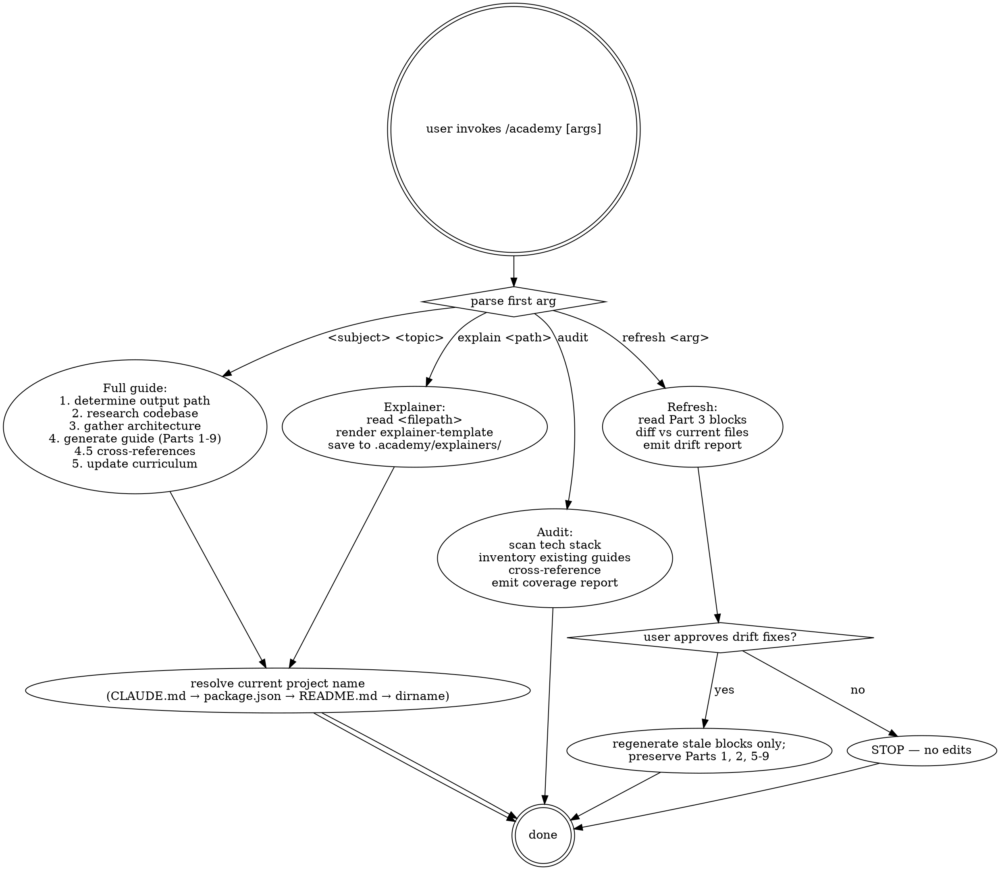

# Academy — Teaching Guide Generator

> **Announce at start (every invocation):** "Using academy to {mode} {target}." — e.g. "Using academy to generate a full guide for testing mocking."

Create self-contained learning guides that teach concepts from zero through real code from the current project (see Project Resolution). Every guide assumes no prior knowledge, defines every term, and explains every code example line by line.

## Project Resolution

Before generating any guide, determine the current project name. Check in order, use the first match:

1. **CLAUDE.md** — look for a project name in the first 20 lines
2. **package.json** — use the `name` field (strip any `@scope/` prefix, title-case)
3. **README.md** — use the first H1 heading
4. **Directory name** — title-case the working directory name

Use the resolved name everywhere this skill says "the current project." In generated guide output, substitute it wherever the template says `{project}`.

## The 2026 AI-Native Developer Philosophy

Traditional developer education: memorize syntax → build toy projects → eventually work on real code. Your path: **read real code → understand patterns → direct AI agents to build more of it.** The skills that matter: code literacy, pattern recognition, architecture vocabulary, prompt precision, and review confidence. Every guide teaches through the actual code you're shipping.

## When to Use

- User says `/academy <subject> <topic>` — generate a full teaching guide
- User says `/academy explain <filepath>` — generate a focused single-file walkthrough
- User says `/academy audit` — scan the project for coverage gaps
- User says `/academy refresh <subject>` or `/academy refresh <filepath>` — update stale code examples
- User asks to learn a topic or create a guide
- User wants to understand a concept through the codebase

## Arguments

### Full Guide Mode

`/academy <subject> <topic>`

- **subject** — broad category (devops, git, testing, etc.). Maps to `.academy/<subject>/` folder.
- **topic** — specific concept within the subject (ci-cd, branching, mocking, etc.)

Check `references/subject-map.md` for valid subjects and topic ideas.

### Quick Mode: Explain a File

`/academy explain <filepath>`

Generates a focused walkthrough of a single file. Output: `.academy/explainers/<filename>-explained.md`. Uses `references/explainer-template.md`.

### Audit Mode

`/academy audit`

Scans the project's tech stack and cross-references against existing guides to find coverage gaps.

### Refresh Mode

`/academy refresh <subject>` or `/academy refresh <filepath>`

Updates stale code examples in existing guides. See "Guide Refresh" section below.

## Routing Table

| Mode | Invocation | Type | Workflow |
|------|------------|------|----------|
| Full guide | `/academy <subject> <topic>` | rigid | Steps 1-5 in Guide Generation Workflow |
| Explainer  | `/academy explain <filepath>` | rigid | Read file → render via `references/explainer-template.md` → save to `.academy/explainers/` |
| Audit      | `/academy audit` | rigid | Codebase Audit section below |
| Refresh    | `/academy refresh <subject\|filepath>` | rigid | Guide Refresh section below — drift report → user approval → regenerate stale blocks only |

All four modes are **rigid**: they follow the documented workflow exactly, including gates (drift approval in refresh, output-path determination in full guide). The *content* generated by each mode is judgment-driven, but the workflow that frames it is not.

## Decision graph



## Guide Generation Workflow

### 1. Determine output location

Map `<subject>` to its `.academy/` subfolder using `references/subject-map.md`. Create the folder if it doesn't exist. Output file: `.academy/<subject>/<topic>-guide.md`.

### 2. Research the codebase

Search the current project's codebase for real examples related to the topic. Prioritize:
- Config files that demonstrate the concept (e.g., `lefthook.yml` for git hooks)
- Source code that uses the pattern (e.g., actual Zustand stores for state management)
- Test files that show the concept in practice
- Scripts, CI configs, migrations — whatever is relevant

Use multiple Explore agents in parallel if the topic spans several areas.

### 3. Gather architectural context

Read `CLAUDE.md` for project conventions, architecture decisions, and design system rules that relate to the topic. Read relevant feature modules if the topic touches them.

### 4. Generate the guide

Follow the template in `references/guide-template.md`. Key structural rules:
- Start with Part 1 (concepts and vocabulary) before any code
- Every guide gets a `> **Tech Stack Mastery:** ...` callout directly under the title showing exactly which technologies the reader gains proficiency in
- Use real project files for Part 3 — annotate every line
- Include ASCII diagrams where they clarify flow or architecture
- Every guide gets a "Prompting AI Agents" section (Part 5) teaching how to use the guide's vocabulary to get better results from Claude Code
- End with opportunities specific to this project

Assign a difficulty rating:
- **Beginner** — 101 guides, single-concept explainers, no prerequisites
- **Intermediate** — full guides on established patterns, assumes basic literacy
- **Advanced** — architecture decisions, security patterns, performance optimization

**101 guides** (topics ending in `-101`) use the condensed template variant: Parts 1-3 plus the Prompting AI Agents section only. They cover breadth, not depth — vocabulary, real examples, and prompting tips.

### 4.5. Add cross-references

After generating the guide:

1. Read the new guide's vocabulary table (Part 1)
2. Grep existing `.academy/**/*-guide.md` files for terms defined in the new vocabulary
3. For each match, add a cross-reference link in a "Related Guides" section at the end of Part 1:

```markdown
### Related Guides

- **middleware** is covered in depth in [Auth Flows](../security/auth-flows-guide.md)
- **state management** — see [State Management](../architecture/state-management-guide.md)
```

4. Also update the matched guides to link back to the new guide where relevant

### 5. Update the curriculum

Add the new guide to `.academy/README.md`. If 3+ guides exist, organize them into a **phased learning path**:

1. Read all existing guides' vocabulary tables
2. Build a dependency graph: if Guide B uses terms defined in Guide A's vocabulary, A is a prerequisite
3. Group into phases: Phase 0 = guides with no prerequisites, Phase 1 = guides depending only on Phase 0, etc.
4. Structure the README using `references/curriculum-template.md`

If fewer than 3 guides exist, use a simple table listing.

## Writing Rules

From `/technical-writing` — apply these to every sentence:

1. **Active voice.** "GitHub Actions runs your tests" not "Your tests are run by GitHub Actions."
2. **Positive form.** "Use `npm ci`" not "Don't use `npm install`" (unless warning about a specific mistake).
3. **Concrete language.** "Runs `eslint --fix` on staged `.ts` files" not "Performs code quality checks."
4. **No AI puffery.** Ban these words: pivotal, seamless, leverage, delve, robust, cutting-edge, game-changer, unlock, empower.
5. **Conversational tone.** Read it aloud — would you say this to a friend explaining the concept over coffee? If it sounds like a textbook, rewrite it.
6. **Short paragraphs.** Three sentences max. One idea per paragraph.

## Pedagogy Rules

These are non-negotiable. They define what makes an Academy guide different from documentation.

1. **Assume zero prior knowledge** of the topic. If the guide is about CI/CD, explain what "continuous" means in this context. If it's about mocking, explain what a mock is before showing one.

2. **Define every technical term** the first time it appears. Use a vocabulary table near the top, then bold the term inline when first used. Example: "A **pipeline** is a sequence of automated steps..."

3. **Explain every code example line by line.** Not "here's the config" — walk through each line with inline comments or a numbered breakdown below the block.

4. **Use the actual project codebase** for examples whenever possible. If the concept doesn't exist in the codebase yet, show what it would look like if added, and note that it's hypothetical.

5. **Start with "What problem does this solve?"** before any how-to. The reader should understand the pain before the medicine.

6. **Build concepts incrementally.** Each section builds on the last. Never reference a concept that hasn't been introduced yet.

7. **Include a vocabulary table** in Part 1 with every key term defined in plain English.

8. **End with a quick-reference summary table** — one-sentence definitions for every concept covered.

9. **Include "What's next" opportunities** — concrete things that could be added to the current project using this knowledge.

10. **No assumed context.** Don't say "as you know" or "obviously." If it were obvious, the reader wouldn't need the guide.

## Red Flags

These thoughts mean STOP. You are rationalizing.

- Generating a guide before resolving the project name. The substituted `{project}` token is wrong everywhere downstream.
- Writing Part 3 with generic examples ("imagine a function that...") when a real file in the codebase demonstrates the concept. The point of Academy is real code.
- Claiming a topic is "covered" in audit mode based on filename alone, without reading the guide's vocabulary table.
- Refresh: silently rewriting Parts 1, 2, or 5-9 when only Part 3 is stale. The pedagogy spine is preserved unless the underlying concept changed.
- Refresh: regenerating any block without showing the user the drift report and getting approval first.
- Skipping line-by-line explanation for "obvious" code. If it were obvious, the reader wouldn't need the guide.
- Using any banned puffery word (pivotal, seamless, leverage, delve, robust, cutting-edge, game-changer, unlock, empower) "just this once." The list isn't aspirational; it's enforced.
- Marking the Quality Checklist complete without re-reading the generated file end to end. A checklist filled from intent is worthless.
- Adding a guide to `.academy/README.md` without rebuilding the phased learning path when ≥3 guides exist.
- Audit mode: declaring "no gaps" without reading both `package.json` *and* the framework-specific config files. A missing eslint config != no linting.

## Rationalization Defense

| Excuse | Reality |
|---|---|
| "The reader can infer the project context" | Project name resolution is mechanical and free. Skipping it produces guides that say "Project" instead of the real name. |
| "This file is too long to annotate every line" | If the file is too long for line-by-line, you've picked the wrong example. Pick a shorter file or a representative slice. |
| "I'll just regenerate the whole guide on refresh — it's faster" | Parts 1, 2, 5-9 carry the curriculum graph. Wholesale rewrite breaks cross-references in other guides and discards reviewed pedagogy. |
| "The drift report is so small, the user won't care about approval" | Approval is the gate, not a courtesy. The user may have edited Parts 5-9 by hand; rewriting blindly destroys their changes. |
| "The codebase doesn't show this pattern, but I'll explain it generically" | The skill says to mark hypothetical examples as hypothetical, not to silently substitute generic code. Mark and move on. |
| "Audit found 12 gaps — let me suggest all of them" | Suggested Learning Path is a sequence, not a dump. Order by dependency (vocabulary in earlier guides feeds later). |
| "'Leverage' is a perfectly fine word in technical writing" | The ban list exists because these words signal AI-generated prose. Replace with the concrete verb. |
| "The Quality Checklist is for the user to verify, not me" | Both. The skill won't ship a guide that fails its own checklist. Re-read end to end. |
| "I'll skip the cross-reference step — no other guides exist yet" | Glob first. If the result is empty, the step takes one tool call. If it's not, the step is required. |

## TodoWrite atomic checklists

For each mode, create a TodoWrite item per phase **before** starting work. Mark `in_progress` on entry, `completed` immediately on exit. Atomic. Never batch.

### Full guide checklist

1. Resolve project name (CLAUDE.md → package.json → README.md → dirname).
2. Determine output path via `references/subject-map.md`.
3. Research codebase for real examples (Explore agents in parallel if needed).
4. Read CLAUDE.md and relevant feature modules for architecture context.
5. Draft Part 1 (vocabulary + Tech Stack Mastery callout).
6. Draft Parts 2-4 (concepts → real code → patterns).
7. Draft Part 5 (Prompting AI Agents).
8. Draft remaining parts (summary table, what's next).
9. Add cross-references; update matched guides to link back.
10. Update `.academy/README.md` (rebuild phased learning path if ≥3 guides).
11. Run Quality Checklist end to end.

### Explainer checklist

1. Resolve project name.
2. Read the target file in full.
3. Render against `references/explainer-template.md`.
4. Save to `.academy/explainers/<filename>-explained.md`.
5. Verify line-by-line coverage; no skipped sections.

### Audit checklist

1. Scan `package.json` (`dependencies` + `devDependencies`).
2. Scan config files (`.eslintrc`, `tsconfig.json`, jest/vitest configs, docker, etc.).
3. Detect framework indicators (`app/`, `pages/`, `expo`, etc.).
4. Read CLAUDE.md for documented stack.
5. Inventory `.academy/**/*-guide.md` and `.academy/explainers/*-explained.md`.
6. Cross-reference; classify gaps by HIGH/MEDIUM/LOW with justification.
7. Emit coverage report + suggested learning path (dependency-ordered).

### Refresh checklist

1. Locate target guide(s) by `<subject>` or `<filepath>`.
2. For each Part 3 code block with a `// <filepath>` comment, read the current file.
3. Diff guide snippet vs current file content; classify each block CURRENT/STALE.
4. Emit drift report.
5. **GATE** — present drift report; await user approval.
6. Regenerate stale blocks + their line-by-line breakdowns.
7. Preserve Parts 1, 2, 5-9 unless the underlying concept changed.
8. Update vocabulary table if new terms appear.
9. If Tech Stack Mastery changed, update `.academy/README.md`.

## Codebase Audit

`/academy audit` scans the project and reports which parts of the tech stack have guides and which don't.

### Audit Workflow

1. **Scan the tech stack:**
   - Read `package.json` dependencies (both `dependencies` and `devDependencies`)
   - Scan for config files (`.eslintrc`, `tsconfig.json`, `jest.config.*`, `docker-compose.yml`, etc.)
   - Check for framework indicators (`app/` = Expo Router, `pages/` = Next.js, etc.)
   - Read CLAUDE.md for documented stack

2. **Inventory existing guides:**
   - Read `.academy/README.md` if it exists
   - Glob `.academy/**/*-guide.md` and `.academy/explainers/*-explained.md`

3. **Cross-reference and report:**

```
## Academy Coverage Audit — {project}

**Tech stack detected:** [list]
**Existing guides:** [N] guides, [M] explainers

### Coverage Gaps (Recommended Guides)

| Priority | Subject | Topic | Why |
|----------|---------|-------|-----|
| HIGH | testing | vitest-basics | 47 test files found, no testing guide exists |
| HIGH | databases | migrations | supabase/migrations/ has 12 files, no guide |
| MEDIUM | security | auth-flows | src/features/auth/ detected |
| LOW | devops | docker | Dockerfile found but simple setup |

### Already Covered

| Subject | Guide | Last Updated |
|---------|-------|-------------|
| basics | TypeScript-101 | 2026-02-10 |

### Suggested Learning Path

Based on gaps, generate these guides in order:
1. `/academy testing vitest-basics` (foundation)
2. `/academy databases migrations` (no prerequisites)
3. `/academy security auth-flows` (requires testing basics)
```

## Guide Refresh

`/academy refresh <subject>` or `/academy refresh <filepath>` updates stale code examples in existing guides.

### Refresh Workflow

1. **Detect staleness:**
   - Read the guide's Part 3 (annotated code sections)
   - For each code block with a `// <filepath>` comment, read the actual file
   - Diff the guide's snippet against the current file content
   - Flag blocks where the code has changed

2. **Report drift:**
   ```
   ## Guide Drift Report: <guide-name>

   | Section | File | Status | Changes |
   |---------|------|--------|---------|
   | Part 3, Block 1 | src/auth/login.ts | STALE | Function renamed, new parameter added |
   | Part 3, Block 2 | src/db/client.ts | CURRENT | No changes |
   | Part 4, Pattern 1 | src/middleware.ts | STALE | Middleware signature changed |
   ```

3. **Update with approval:**
   - Present the drift report to the user
   - On approval, regenerate only the stale Part 3 code blocks and their line-by-line breakdowns
   - Preserve Parts 1, 2, 5-9 unless the underlying concepts changed (e.g., library was replaced)
   - Update the guide's vocabulary table if new terms appear in the refreshed code

4. **Update curriculum:**
   - If the guide's Tech Stack Mastery changed, update `.academy/README.md`

## Quality Checklist

Before finishing, verify:

- [ ] Every technical term is defined before use
- [ ] Every code block has line-by-line explanation
- [ ] Real codebase examples are used (not generic samples)
- [ ] Vocabulary table exists in Part 1
- [ ] "Prompting AI Agents" section exists (Part 5)
- [ ] Tech Stack Mastery callout exists under the title
- [ ] Summary table exists in Part 9
- [ ] "What's next" section has project-specific opportunities
- [ ] No banned words (pivotal, seamless, leverage, delve, etc.)
- [ ] Conversational tone throughout
- [ ] `.academy/README.md` updated with new entry

## Rule loading map

SKILL.md is the orchestrator. References load only when the matching mode runs.

| File | Loaded by | Purpose |
|---|---|---|
| `references/guide-template.md` | Full guide mode (step 4) | Part 1-9 structure, Tech Stack Mastery callout shape |
| `references/explainer-template.md` | Explainer mode | Single-file walkthrough layout |
| `references/curriculum-template.md` | Full guide step 5 (when ≥3 guides) | Phased learning path layout |
| `references/subject-map.md` | Full guide step 1, Audit mode | Subject → folder mapping, valid topic ideas |
| `references/skill-self-test.md` | `pressure-test` (skill-modernizer) | Acceptance scenarios for this skill |

## Provides

- **Output convention:** `.academy/<subject>/<topic>-guide.md` for full guides; `.academy/explainers/<filename>-explained.md` for explainers; `.academy/README.md` as the curriculum index.
- **Vocabulary tables** in every guide — other skills can grep these for cross-linking.
- **Drift report format** (Section | File | Status | Changes) — stable across refresh runs.
- **Coverage audit format** (Priority | Subject | Topic | Why) — stable across audit runs.

## Consumes

- `technical-writing` (referenced) — Writing Rules section borrows its active-voice / banned-puffery list.
- `Explore` subagent (optional) — used in step 2 (Research the codebase) when topic spans multiple areas.
- `CLAUDE.md` (project-level) — read for architecture conventions and project name.
- `package.json` / framework configs (project-level) — read for tech stack detection in Audit mode.

## Self-test pointer

Pressure scenarios for this skill itself live in `references/skill-self-test.md`. Run `/skill-modernizer pressure-test /Users/canodevelopment/.claude/skills/academy` (or the equivalent install path) to verify all scenarios pass.
