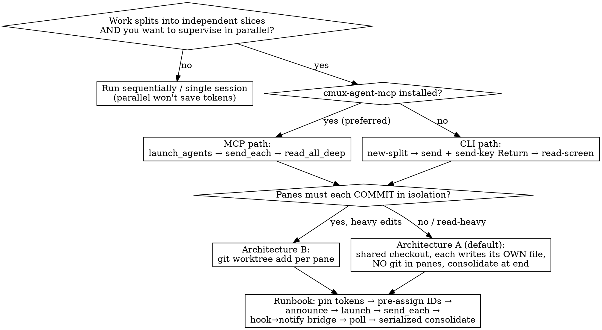

# cmux parallel agents

**Flexible skill.** Adapt the driving path (MCP vs CLI) and isolation architecture (A vs B) to
the situation — but treat **the four traps** and **the shared-mutable contention rule** as firm;
they are the parts the tooling will silently let you get wrong.

cmux (cmux.com, by manaflow-ai) is a **macOS-only** native terminal multiplexer built for running
AI coding agents in parallel. A *primary* agent opens panes, launches an agent CLI in each, sends
each a distinct prompt, and watches them — all in one window. `cmux-agent-mcp` exposes that control
plane as ~81 MCP tools.

**Why this skill exists:** as of this writing, `cmux-agent-mcp` registers **no MCP `instructions`
block** and its tool descriptions are capability-only (verified in `src/cmux-mcp.ts`). So at runtime
the model receives bare tool schemas and *nothing* about how to sequence a run or which traps to
dodge. The good guidance lives in the README — which the host never injects into the conversation.
This skill is the runtime-available playbook.

## Decision flow

## First decide: is parallel actually right?

Parallelism here buys **control and wall-clock speed**, not token savings.

- Vs running the same N tasks **sequentially**: roughly the *same* token cost — you pay for N runs either way; you just finish sooner.
- Vs cramming everything into **one big session**: parallel panes are usually *cheaper and higher-quality*, because each pane keeps a small, isolated context (no giant transcript re-sent every turn, no lossy auto-compaction).
- The tax: ~N× fixed startup overhead (each pane reloads system prompt, project memory, MCP defs, any template it reads).

Reach for parallel panes when the work splits into independent slices and you want to supervise them side-by-side. Don't reach for it expecting a smaller bill than sequential.

## The two driving paths

**Prefer the MCP path.** Install once: `npm i -g cmux-agent-mcp && cmux-agent-mcp init`. Then drive panes with `cmux_launch_agents`, `cmux_orchestrate`, `cmux_send_each`, `cmux_send_submit`, `cmux_read_all_deep`. Preferred mainly because `cmux_send_submit`/`cmux_send_each` bundle the Enter keypress, sidestepping trap #1.

**Raw CLI path** (no extra install): `cmux list-pane-surfaces`, `cmux new-split`, `cmux send` + `cmux send-key`, `cmux read-screen`. Use when you can't add the MCP.

Full command + tool inventory: **`references/cmux-cli-reference.md`** — read it before scripting a run.

## The four traps

### 1. `send` does not press Enter
Bare `cmux_send` / `cmux send` *types* the text and stops — the prompt sits unsent in the input box.
The MCP encodes this only by tool *naming* (`send` vs `send_submit`), never as a warning.
- **Rule:** prefer `cmux_send_submit` (one pane) and `cmux_send_each` (distinct text per pane). On the raw CLI, always pair `cmux send …` with a following `cmux send-key … Return`. If a pane looks hung with your prompt visible but not running, this is almost always why.

### 2. There is no completion / ack signal
Nothing emits an event when a pane finishes, errors, or stops at a human-in-the-loop gate. "Monitoring" means *you poll*.
- **Rule:** poll `cmux_read_all_deep` (it even pings idle agents for status) or `cmux read-screen` and parse the terminal text. **Bridge the gap** with a Claude Code **Stop hook** in each pane's session that runs `cmux notify` / `cmux set-status` — so an idle pane *rings* instead of waiting silently. Without this bridge, a run with per-pane approval gates makes you eyeball N panes; the human becomes the bottleneck.

### 3. No automatic per-pane git worktree — isolation is your job
cmux *displays* a branch in its sidebar but does **not** create a worktree per pane/tab. Multiple agents in one checkout share one working tree and one git index. See the contention rule below — this is the trap that silently corrupts shared state.

### 4. Address panes by typed refs, never bare numbers
Targets are `surface:N` / `workspace:N`, not `2`. Enumerate live refs with `cmux list-pane-surfaces` (CLI; also `cmux list-panes` / `cmux tree`) or `cmux_identify` / `cmux_list_pane_surfaces` (MCP) before sending — pane numbering is not stable enough to assume.

## Red Flags

These thoughts mean STOP — the tooling will let you do them, and each silently breaks a run:

- "I'll send the prompt and it'll start running." → Bare `send` doesn't press Enter (trap #1). Use `send_submit`/`send_each`, or pair with `send-key … Return`.
- "Each pane can compute its own next ID/filename from the directory." → All panes read the same state at once and collide. Pre-assign per pane.
- "The panes can all edit the shared index/roadmap; I'll reconcile conflicts later." → Concurrent writes clobber. Keep shared-file edits out of the panes; consolidate serially.
- "One shared checkout is fine even though panes commit." → Concurrent `git` fights over one index; commits grab each other's staged files. Use Architecture B (worktree per pane) or forbid git in panes.
- "`surface:2` is stable enough; I'll skip `list-pane-surfaces`." → Pane refs aren't guaranteed; address only refs you just enumerated.
- "No ack signal, but I'll just assume they're done after a while." → Guessing completion drops work. Poll `read_all_deep` and wire the Stop-hook→notify bridge.
- "I'll trust the send spelling from memory/a blog." → cmux's own docs disagree (`send` vs `send-surface`, `"Return"` vs `enter`). Run `cmux send --help` on the actual box first.

## Rationalization Defense

| Excuse | Reality |
|---|---|
| "Parallel will be cheaper than running them one at a time." | It saves wall-clock, not tokens — you pay for N runs either way. It's only cheaper than *one mega-session*. Pick it for control + speed. |
| "`cmux_send` is the obvious tool to send a prompt." | `cmux_send` omits Enter by design. `cmux_send_submit` / `cmux_send_each` are the ones that actually run the prompt. |
| "The MCP knows the traps, so I don't need to." | The MCP ships no instructions block and no trap warnings — verified in source. At runtime the model gets bare tool schemas. This skill is the only guidance. |
| "cmux shows a git branch per pane, so panes are isolated." | The branch is a display pill, not a worktree. One checkout = one shared index. Isolation is the orchestrator's job. |
| "Letting panes write the shared file is simpler than a consolidation step." | Simpler until two writes race and one is lost. Distinct-file-per-pane + one serial consolidation is the safe shape. |
| "I'll watch the panes myself instead of wiring notifications." | With no ack signal, watching N panes makes you the bottleneck. The Stop-hook→`cmux notify` bridge turns silence into a ring. |

## The shared-mutable contention rule (the durable lesson)

N parallel agents in **one repo on one branch** collide on exactly three shared mutables:

1. **Any ID/name derived from filesystem state** — every pane reads "the highest existing N" at the same instant and all pick N+1 → collision.
2. **Shared files** — a central index, roadmap, manifest, or registry edited by several panes at once → clobbered writes / merge conflicts.
3. **The git index** — concurrent `git add`/`commit` on one working tree fight over `index.lock`, and one commit grabs another's staged files.

**Rule:** keep these three out of the panes.
- **Pre-assign** the unique ID / output filename to each pane in its prompt — don't let panes compute it.
- Have each pane write **only its own distinct file**; forbid edits to shared files and forbid `git` inside panes.
- **Serialize the write/commit phase**: one consolidation pass (you, or a final single agent) stitches the shared file and makes the commit(s).

### Two isolation architectures

- **Architecture A — shared checkout, deferred writes (default).** All panes run in one checkout, each produces its own uniquely-named artifact, no pane touches shared files or git. A single consolidation step at the end wires shared files + commits. Simplest, and safe *because* the only concurrent writes are to distinct filenames. Best for read-heavy / light-write work (audits, research, analysis).
- **Architecture B — worktree per pane.** Script `git worktree add` yourself (cmux won't), `cd` each pane into its tree, let each commit to its own branch, merge after. Use when panes must do heavy independent edits + commits. Heavier: N worktrees, a merge-back step, and each worktree forks from the base branch's HEAD (mind dependencies between panes).

When unsure, start with A. Move to B only when panes genuinely need to commit in isolation.

## Verify the command surface on-device before scripting

cmux's own docs disagree on three literal tokens: the targeted-send verb (`cmux send --surface` vs `cmux send-surface`), the Enter key name (`"Return"` vs `enter`), and the surface-enumeration command (`list-surfaces` in older docs vs `list-pane-surfaces` / `list-panes` / `tree` on current builds). Before committing a script, run `cmux send --help` (and `cmux --help`) on the actual install and pin the real spellings. Don't hardcode from memory or from a blog.

## End-to-end orchestration runbook

Track this as a TodoWrite list — one item per phase, marked `in_progress`/`completed` as you go — so a long parallel run stays observable and you never skip the consolidation step.

0. **Announce the plan** in user-facing text before launching: how many panes, which path (MCP/CLI), which architecture (A/B), and the per-pane ID/file assignments. Committing to this up front is what prevents the contention traps mid-run.
1. **Confirm host:** macOS, cmux installed (`brew tap manaflow-ai/cmux && brew install --cask cmux`), `cmux` on PATH. If using the MCP, `cmux-agent-mcp init` has run.
2. **Pin tokens:** run `cmux send --help`; note the real send verb + Enter token (trap #4 / verify gate).
3. **Pick architecture:** A (default) or B (heavy isolated commits).
4. **Pre-assign per-pane work:** for each pane, fix its slice *and* its unique output filename/ID up front (contention rule). Forbid shared-file edits and `git` inside panes unless using B.
5. **Open panes & launch agents:** `cmux_launch_agents(cli:"claude", count:N)` (MCP) or `cmux new-split` ×N then `cmux send`+`send-key "Return"` to start `claude` in each (CLI).
6. **Send distinct prompts:** `cmux_send_each` (one call, distinct text per pane) — or `cmux_send_submit` per pane. Never bare `send` without a Return (trap #1).
7. **Add the readiness bridge:** ensure each session's Claude Code Stop hook fires `cmux notify` so idle/gated panes ring (trap #2).
8. **Monitor:** poll `cmux_read_all_deep` / `cmux read-screen`; respond to rings.
9. **Consolidate (serialized):** after panes finish, one pass merges shared files and commits — no parallel commits (contention rule).

## Provides / Consumes

**Provides:** the four-trap set, the shared-mutable contention rule, and the A/B isolation decision — a reusable safety playbook any orchestrator agent can apply to parallel terminal runs.

**Consumes:** `cmux-agent-mcp` (the MCP control plane) and Claude Code **Stop hooks** (for the readiness-ring bridge). Composes with `superpowers:using-git-worktrees` (Architecture B worktree mechanics) and `superpowers:dispatching-parallel-agents` (when the right answer is in-process subagents rather than separate terminal sessions).

## Rule loading map (token-budgeted progressive disclosure)

SKILL.md is self-contained for planning a run. Load the reference only when scripting:

| File | ~tokens | Loaded when |
|---|---|---|
| `references/cmux-cli-reference.md` | ~1,100 | Scripting an actual run — need exact CLI flags, the ~81-tool MCP map, install steps, the Stop-hook→notify snippet, or the worktree-B sketch |
| `references/skill-self-test.md` | ~700 | Pressure-testing or modernizing this skill — the RED/GREEN scenarios it must satisfy |

- Official docs: `cmux.com/docs/api`, `/getting-started`, `/notifications`.
- Repo: `github.com/multiagentcognition/cmux-agent-mcp` (`src/cmux-mcp.ts` = tool defs; README `## Orchestration Workflow` + `## ID Reference Format`).
