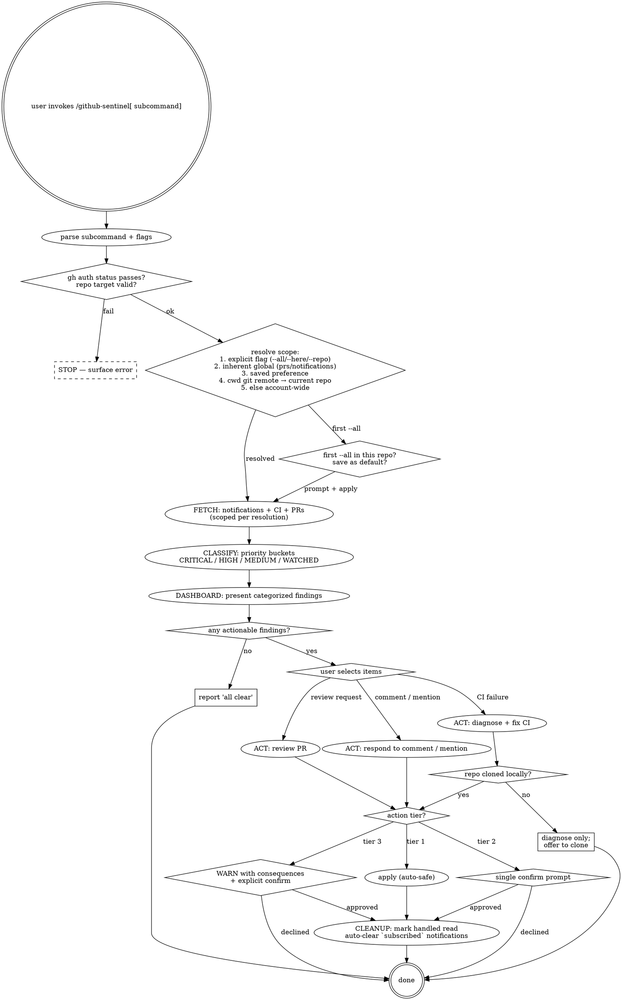

# GitHub Sentinel

Cross-repo GitHub monitoring — CI failures, PR reviews, issue mentions, and notifications. Diagnoses problems, prepares fixes, and acts on your behalf with safety gates.

> **Announce at start (every invocation):** "Using github-sentinel to {subcommand} {target}."

## When to Use

- `/github-sentinel` or `/github-sentinel check` — one-shot scan of all notifications + CI status
- `/github-sentinel watch` — continuous monitoring via `/loop` (polls every 5 minutes)
- `/github-sentinel ci` — CI-only check across all repos
- `/github-sentinel prs` — PR-only check (reviews, comments, requests)
- `/github-sentinel fix <run-url>` — diagnose and fix a specific CI failure
- `/github-sentinel notifications` — show and triage all GitHub notifications
- Automatically via **post-push hook** — monitors CI after every `git push`

## Prerequisites

- `gh` CLI authenticated (`gh auth status` should succeed)
- Git repos cloned locally for auto-fix capability (remote-only repos get diagnosis only)

## Subcommand Routing

| Invocation | What It Does | Type |
|---|---|---|
| `/github-sentinel` | Full check: notifications + CI + PRs | rigid |
| `/github-sentinel check` | Same as `/github-sentinel` | rigid |
| `/github-sentinel watch` | Start `/loop 5m /github-sentinel check` for continuous monitoring | rigid |
| `/github-sentinel ci` | CI failures only across all repos | rigid |
| `/github-sentinel prs` | PR reviews, comments, and requests only | rigid |
| `/github-sentinel fix <url>` | Diagnose + fix a specific failed CI run | rigid |
| `/github-sentinel notifications` | List and triage all GitHub notifications | rigid |
| `/github-sentinel setup` | Install post-push hook in current project | rigid |

### Scope flags (apply to all subcommands)

| Flag | Effect |
|---|---|
| *(none)* | Smart default: current repo when in a git repo; account-wide otherwise. `prs` / `notifications` / `fix <url>` ignore scope (inherently global / URL-derived). |
| `--all` | Force account-wide. On first use in a repo, asks if you want to save this as the default for that repo. |
| `--here` | Force current repo only. Also clears any saved `--all` preference for this repo. |
| `--repo owner/name` | Scope to a specific repo by name (no auto-detection). |

---

## Scope Detection

Pre-flight resolves scope BEFORE any `gh` query so FETCH knows whether to pass `--repo <owner/name>` or run account-wide.

### Resolution order

1. **Explicit flag wins.** If `--repo`, `--all`, or `--here` is passed, use it directly and skip steps 2–4.
2. **Inherently global subcommand.** If subcommand is `prs`, `notifications`, or `fix <url>`, scope is fixed (account-wide for the first two, URL-parsed for `fix`). Skip steps 3–4.
3. **Saved preference.** Read `~/.claude/.skill-state/github-sentinel/preferences.json`. If `git remote get-url origin` matches a key, apply the saved scope.
4. **Smart default.** If `git rev-parse --show-toplevel` succeeds (cwd is inside a git repo), parse `git remote get-url origin` and scope to that repo. Otherwise, account-wide.

### Preference file

```
~/.claude/.skill-state/github-sentinel/preferences.json
```

Schema:

```json
{
  "git@github.com:acme/api-server.git": { "scope": "all", "set_at": "2026-05-08" },
  "git@github.com:user/personal-blog.git": { "scope": "current", "set_at": "2026-05-08" }
}
```

Keys are normalized git remote URLs (origin). Values record the user's chosen scope and when they set it.

### Save-preference prompt

The skill asks **only** when the user explicitly passes `--all` for the first time in a repo (no existing entry for that remote). Format the prompt via `AskUserQuestion`:

> *"You ran `--all` from acme/api-server. Save `--all` as the default for this repo? (Use `--here` later to revert.)"*
> Options: **Yes, remember** / **No, just this once**

If the user already has a saved preference for this repo, never re-ask — silently apply it.

If the user passes `--here`, clear any existing preference for that repo (no prompt — `--here` is the explicit revert).

### Banner

Every dashboard opens with one of:

```
Scope: acme/api-server (current repo) — `--all` for account-wide
Scope: acme/api-server (your saved preference) — `--here` to override
Scope: account-wide (auto: not in a git repo) — `--repo owner/name` to narrow
Scope: account-wide (`--all` flag) — drop the flag to scope to current repo
```

The banner is mandatory. Skipping it makes scope behavior invisible and turns smart defaults into surprises.

---

## Decision graph



---

## Core Workflow

Every invocation follows the same 5-step pipeline:

```
FETCH → CLASSIFY → DASHBOARD → ACT → CLEANUP
```

### Step 1: FETCH — Gather signals

Resolve scope first (see `## Scope Detection`). Then run the queries the resolved scope and subcommand require.

**Scoped (current repo):**

```bash
# CI failures on the current repo only — fast: scopes to one repo
gh run list --repo <owner/name> --status failure --limit 20 --json databaseId,name,headBranch,conclusion,updatedAt,url,repository

# Open PRs on the current repo
gh pr list --repo <owner/name> --state=open --json number,title,url,updatedAt,author
```

**Account-wide (only when scope resolves to "all"):**

```bash
# CI failures across all user repos
gh run list --user $(gh api user -q .login) --status failure --limit 20 --json databaseId,name,headBranch,conclusion,updatedAt,url,repository
```

**Always-global (regardless of scope):**

```bash
# Notifications — inherently account-wide
gh api notifications --paginate --jq '.[] | {id: .id, reason: .reason, title: .subject.title, type: .subject.type, repo: .repository.full_name, url: .subject.url, updated: .updated_at}'

# PRs where user is requested reviewer — inherently cross-repo
gh search prs --review-requested=@me --state=open --json repository,number,title,url,updatedAt

# PRs authored by user — inherently cross-repo
gh search prs --author=@me --state=open --json repository,number,title,url,updatedAt
```

When scope is current-repo, post-filter the always-global queries to only show items whose `repository.full_name` matches the current repo. Notifications stay surfaced for transparency, but the dashboard groups out-of-scope notifications under a collapsed "Other repos" line.

For subcommand-specific invocations, only run the relevant subset.

### Step 2: CLASSIFY — Triage by priority

Sort all signals into priority buckets:

| Priority | Category | Signal Source |
|----------|----------|---------------|
| CRITICAL | CI failure on default branch | `gh run list --status failure` where branch is main/master |
| HIGH | Review requested for you | `notifications.reason == review_requested` |
| HIGH | CI failure on your PR | Failed checks on PRs you authored |
| MEDIUM | PR comment / mention | `notifications.reason == mention` or `comment` |
| MEDIUM | CI failure on feature branch | Non-default branch failures |
| WATCHED | Subscribed notifications | Releases, dependabot PRs, other subscribed events (auto-marked read) |

### Step 3: DASHBOARD — Present findings

Display a categorized summary. The first line is ALWAYS the scope banner so the user knows what was scanned. Format:

```
GitHub Sentinel — Status Report
Scope: acme/api-server (current repo) — `--all` for account-wide
━━━━━━━━━━━━━━━━━━━━━━━━━━━━━━

🔴 CI Failures ({count})
  1. [CRITICAL] owner/repo — workflow "CI" failed on main
     Run: https://github.com/owner/repo/actions/runs/12345
  2. [HIGH] owner/repo — workflow "Deploy" failed on feature-branch (your PR)
     Run: https://github.com/owner/repo/actions/runs/67890

🟡 Review Requests ({count})
  3. [HIGH] owner/repo#42 — "Add new feature"
     Requested 2 hours ago

🔵 Mentions & Comments ({count})
  4. [MEDIUM] owner/repo#15 — "Bug in auth flow"
     You were mentioned 30 minutes ago

📋 Watching Activity — {count} notifications auto-cleared from {repo_count} watched repos (type "show watched" to expand)

Select items to act on (e.g., "1,2" or "all ci" or "all"):
```

If no findings: report "All clear — no CI failures, no pending reviews, no new mentions."

### Step 4: ACT — Handle selected items

For each selected item, execute the appropriate workflow:

#### CI Failure → Diagnose + Fix

Load `rules/ci-diagnosis.md` for detailed patterns.

1. Fetch failed logs: `gh run view <run-id> --repo <owner/repo> --log-failed`
2. Fetch the workflow file: `gh api repos/<owner>/<repo>/contents/.github/workflows/<name>.yml`
3. Parse log output — identify the failing step and error message
4. Classify the failure (see `rules/ci-diagnosis.md` for categories)
5. If the repo is cloned locally:
   - Navigate to the repo directory
   - Read the failing file(s)
   - Propose a fix
   - On user approval: edit, commit, push
6. If remote-only:
   - Present diagnosis and suggested fix
   - Offer to clone and fix, or provide manual instructions

#### Review Request → Review PR

Load `rules/pr-response.md` for review patterns.

1. Fetch PR diff: `gh pr diff <number> --repo <owner/repo>`
2. Fetch PR description: `gh pr view <number> --repo <owner/repo>`
3. Read the diff and provide a review
4. On user approval: post review via `gh pr review <number> --repo <owner/repo>`

#### PR Comment → Respond or Fix

Load `rules/pr-response.md`.

1. Fetch comment thread: `gh api repos/<owner>/<repo>/pulls/<number>/comments`
2. Or for issue comments: `gh api repos/<owner>/<repo>/issues/<number>/comments`
3. Understand what's being asked
4. If code change requested: prepare fix, commit, push to PR branch
5. If question: draft response, post on approval

#### Issue Mention → Respond

Load `rules/issue-triage.md`.

1. Fetch issue: `gh issue view <number> --repo <owner/repo>`
2. Read the issue and any comments mentioning you
3. Draft a response
4. On approval: post via `gh issue comment <number> --repo <owner/repo>`

### Step 5: CLEANUP — Mark handled

**Auto-mark-read**: All `subscribed` notifications (watched repos — releases, dependabot PRs, etc.) are automatically marked as read during cleanup. No user confirmation needed — these never require action.

```bash
# Auto-clear subscribed notifications (runs automatically)
# For each notification where reason == "subscribed":
gh api notifications/threads/<thread-id> -X PATCH

# Mark individual acted-on notification as read
gh api notifications/threads/<thread-id> -X PATCH

# Or mark all as read (if user selects "all")
gh api notifications -X PUT -f last_read_at=$(date -u +%Y-%m-%dT%H:%M:%SZ)
```

---

## Safety Gates

Load `rules/safety-gates.md` for the full matrix.

### Auto-safe (no confirmation needed)
- Fetching notifications, CI logs, PR diffs, issue content
- Diagnosing failures and preparing fix proposals
- Reading code in any local repo
- Marking `subscribed` notifications as read

### Requires user confirmation
- Pushing code to any branch
- Creating commits
- Posting comments on PRs/issues (visible to others)
- Rebasing or merging branches
- Approving or requesting changes on PRs
- Re-running failed CI jobs

### Never auto-do (always warn + confirm)
- Force pushing to any branch
- Deleting branches
- Merging PRs
- Closing PRs or issues
- Modifying repo settings or permissions

---

## Red Flags

These thoughts mean STOP. You are rationalizing.

- "The fix is obvious; I'll commit and push without showing the diff first." Tier 2 actions ALWAYS require explicit confirmation, even when the diagnosis seems certain. Show the diff, group commit + push into one prompt, wait for approval.
- "The repo isn't cloned locally, but `gh api` lets me push the file change directly." Never edit files via `gh api`. It bypasses local git history, pre-commit hooks, signing, and merge protection. Always work through local git — clone first if needed.
- "User picked 'all' on the dashboard — I can include the force-push action in the batch." `all` only batches Tier 1 and Tier 2 actions. Tier 3 (force-push, delete branch, merge PR, close PR/issue) ALWAYS confirms individually with full consequence warning, even when the user said "all".
- "This `mention` notification got handled, so I'll auto-clear it like the `subscribed` ones." Only `reason == subscribed` auto-clears. Mentions, review requests, and CI failures stay unread until the user explicitly acts on them.
- "Watch loop just ran cycle 2; I'll re-show the same CI failure from cycle 1 since it's still unfixed." `/loop` cycles MUST dedupe against previously-reported items. Re-reporting unchanged items turns the terminal into noise and trains the user to ignore the dashboard.
- "Cross-repo fix means I'll silently `cd` into `~/coding-portfolio/other-repo` to make the change." Cross-repo context switches must be announced. Use `--repo` flag on `gh` commands, or explicitly say "switching to {owner/repo}" before any local git operation in another directory.
- "Post-push hook detected CI failure; I'll auto-fix and push again." The hook is monitor-only by design. Auto-fixing creates infinite push loops. Surface the failure and offer `/github-sentinel fix`.
- "I've re-run this flaky CI three times and it failed; once more should do it." Cap is 3 retries per commit. After three failures, it's a real failure, not flakiness. Stop retrying and diagnose.
- "Only one finding, so I'll skip the dashboard and go straight to acting." The dashboard is the user's redirect point. Always show, even for n=1 — the user may want to defer.
- "Cwd is in a git repo, but I'll run account-wide anyway since it's more thorough." Smart default is current repo when in a git repo. Running account-wide silently is exactly the noise problem this skill is supposed to solve. If the user wants account-wide, they'll pass `--all` (and the skill will offer to remember it).
- "Banner adds clutter — I'll skip it for clean dashboards." The scope banner is mandatory. Without it, the user can't tell whether 'all clear' means 'all clear in this repo' or 'all clear across all 50 repos'. Silent magic = lost trust.
- "User passed `--all` and I already prompted them last time, so I'll re-prompt to confirm." Re-asking when a saved preference exists is friction without value. Read the preference file in pre-flight; if hit, apply silently.

---

## Rationalization Defense

| Excuse | Reality |
|---|---|
| "Confirmation slows me down — the fix is trivial." | Confirmation is the contract. A trivial fix on the wrong file is still a wrong fix. Cost of a single prompt is seconds; cost of an unattended bad push can be hours. |
| "Force-pushing my own feature branch is fine — no one else uses it." | Force-push warning fires on ALL branches. Collaborators may have pulled, CI may have cached, and the warning teaches you the habit before it matters. |
| "I'll batch the commit and the rebase into one Tier 2 prompt." | Don't merge tiers. Commit + push of one fix is one Tier 2 (tightly coupled). Rebase + force-push is Tier 3 (different risk class). Never mix tiers in one confirmation. |
| "The dashboard already showed the item; I can act on the user's selection without re-stating the target." | The user may have selected items minutes after the dashboard rendered. Always re-state the exact target before acting: "Posting comment on owner/repo#42 — confirm?" |
| "`gh api` is faster than cloning — I'll just patch the file remotely." | `gh api` for file edits skips pre-commit hooks, signing, and your local diff review. Speed gained is correctness lost. Always go through local git. |
| "Some `subscribed` notifications might actually be important — I'll surface them too." | If you're tempted to surface a `subscribed` notification, the classifier is wrong. Fix the classifier; don't subvert the auto-clear category. Auto-clear is a load-bearing UX promise. |
| "There's only one finding, so the dashboard is overkill." | Skipping the dashboard removes the user's ability to redirect, defer, or batch. Always render — even n=1 — so the interaction shape stays consistent. |

---

## Post-Push Hook

The hook monitors CI after every `git push` within Claude Code. It is **monitor-only** — it reports failures but does not auto-fix (preventing infinite push loops).

### Hook behavior

1. Detects the repo and branch from git
2. Finds the CI run triggered by the push
3. Waits for the run to complete (up to 10 minutes)
4. If failed: outputs failure summary + suggests `/github-sentinel fix`
5. If passed: outputs brief success confirmation

### Installing the hook

Run `/github-sentinel setup` in any project to install, or manually:

1. The hook script lives at `~/.claude/skills/github-sentinel/scripts/post-push-watch.sh`
2. Add to project settings via `/update-config`:

```json
{
  "hooks": {
    "PostToolUse": [
      {
        "matcher": "command",
        "pattern": "git push",
        "command": "bash ~/.claude/skills/github-sentinel/scripts/post-push-watch.sh"
      }
    ]
  }
}
```

The hook output is visible to Claude, so it can immediately offer to diagnose and fix failures.

---

## Cross-Repo Code Fixes

When fixing code in a repo other than the current working directory:

1. **Check if cloned locally**: Look for the repo in common locations:
   - Same parent directory as current repo (e.g., `../other-repo`)
   - `~/coding-portfolio/<repo-name>`
   - Ask the user if not found

2. **If found locally**: Change to that directory, make the fix, commit, push
3. **If not found**: Provide diagnosis + fix instructions, offer to clone

**Never** use `gh api` to push file changes — always work through local git to preserve commit history and avoid merge conflicts.

---

## Continuous Monitoring (`/github-sentinel watch`)

When invoked with `watch`, set up a recurring check:

1. Inform the user: "Starting continuous monitoring. I'll check every 5 minutes."
2. Invoke `/loop 5m /github-sentinel check`
3. The loop runs until the session ends or user cancels

Each check cycle:
- Only reports NEW findings (compare against previous cycle)
- Skips items already acted on in this session
- Aggregates if multiple failures from the same repo

---

## Rule Loading

Load rule files on-demand to minimize context:

| Rule File | Loaded When |
|-----------|-------------|
| `rules/ci-diagnosis.md` | Acting on a CI failure |
| `rules/pr-response.md` | Acting on a PR review/comment |
| `rules/issue-triage.md` | Acting on an issue mention |
| `rules/safety-gates.md` | Before any write action |

---

## TodoWrite checklists

For each invocation, create a TodoWrite item per phase **before** starting work. Mark `in_progress` on entry, `completed` immediately on exit. Atomic. Never batch. The pre-flight gate is always step 1.

### check / (default) checklist

1. Pre-flight: parse subcommand + flags; verify `gh auth status` passes.
2. SCOPE: resolve via flag → inherent global → saved preference → cwd remote → fallback. Save-preference prompt fires only on first `--all` in a new repo.
3. FETCH notifications, CI runs, and PR signals using resolved scope.
4. CLASSIFY signals into priority buckets.
5. DASHBOARD: render scope banner + categorized summary.
6. ACT on each user-selected item through its safety tier.
7. CLEANUP: mark handled notifications read; auto-clear `subscribed`.

### ci checklist

1. Pre-flight.
2. SCOPE resolution (smart default: current repo when in a git repo).
3. Fetch failed runs at resolved scope.
4. Present CI-only dashboard with scope banner.
5. Diagnose each selected failure per `rules/ci-diagnosis.md`.
6. Locate repo locally (or surface diagnosis-only path).
7. Propose fix; gate on user approval.
8. Commit + push as a single Tier 2 confirmation.

### prs checklist

1. Pre-flight.
2. Fetch review requests + PR comments.
3. Present PR-only dashboard.
4. Review or respond to each selected item per `rules/pr-response.md`.
5. Submit each review individually as a Tier 2 confirmation.

### fix `<url>` checklist

1. Pre-flight.
2. Parse run URL into `owner/repo` + run ID.
3. Fetch failed logs.
4. Diagnose failure category per `rules/ci-diagnosis.md`.
5. Locate repo locally (or offer to clone).
6. Propose fix; gate on user approval.
7. Commit + push as a single Tier 2 confirmation.

### watch checklist

1. Pre-flight.
2. Initialize seen-items set for dedup.
3. Start `/loop 5m /github-sentinel check`.
4. On each cycle: dedupe against seen-items before showing.
5. Update seen-items after each cycle.

### setup checklist

1. Pre-flight.
2. Verify hook script exists at canonical path.
3. Install hook into project settings via `/update-config`.
4. Confirm hook fires on next `git push`.

### notifications checklist

1. Pre-flight.
2. Fetch all notifications.
3. Group by repo and reason.
4. Present grouped dashboard.
5. Act on selected items.
6. Mark handled as read; auto-clear `subscribed`.

---

## Provides

- **Action-tier classification** — the auto-safe / Tier 2 confirm / Tier 3 warn matrix in `rules/safety-gates.md` is reusable by other GitHub-touching skills that need a consistent confirmation contract.
- **Post-push monitor hook** — `scripts/post-push-watch.sh` produces a structured failure summary that other skills (or `/loop` cadences) can consume.
- **CI diagnosis categories** — structured failure classification (`rules/ci-diagnosis.md`) that downstream auto-fix tools can read.
- **Dashboard format** — the 🔴 / 🟡 / 🔵 / 📋 categorized summary is a stable presentation contract other monitoring skills can match.

## Consumes

- `gh` CLI (required) — must be authenticated; `gh auth status` is the pre-flight gate.
- `git` (required) — for local commits, pushes, and rebases. Cross-repo fixes require the target repo cloned.
- `/loop` skill (optional) — drives `watch` subcommand cadence (every 5 minutes by default).
- `/update-config` skill (optional) — used by `setup` to install the post-push hook into project settings.

---

## Self-test pointer

Pressure scenarios for this skill itself live in `references/skill-self-test.md`. Run `pressure-test ~/.claude/skills/github-sentinel/` (via `/skill-modernizer`) to verify all scenarios pass.
