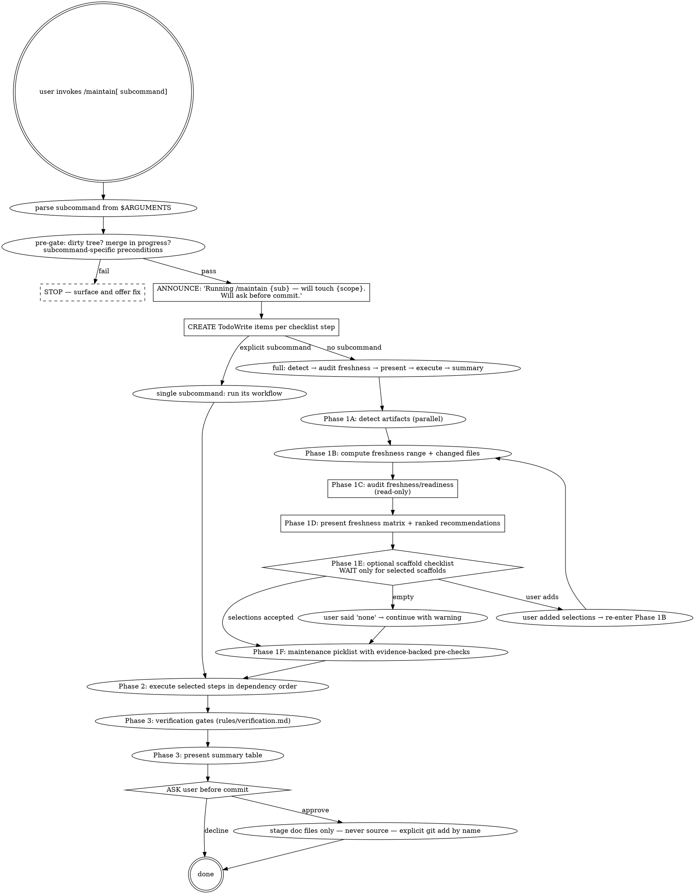

# Maintain

Unified maintenance skill — 13 subcommands, one audit-first orchestrator. This file is the entry point. Verbose specs live in `references/`; rule libraries live in `rules/`. Both are loaded on demand.

**Skill type:** **rigid** for `full`, `sync`, `refs`, `release`, `secrets`, `locks` (gates and verification are non-negotiable). **flexible** for `scaffold`, `prune`, `deadcode`, `lint-drift`, `env`, `links` (inherently judgment-driven).

---

## Migration Note

Previously two separate skills:

- `/sync-docs` → now `/maintain sync`
- `/update-stale-references` → now `/maintain refs`

Both old invocations still route here.

**2026-05 — `refs` discovery mode added.** `refs` originally required user-supplied `old_patterns` + `new_context` and would prompt indefinitely (or fail) when called with no inputs. A real friction point during a milestone close-out — a plan author wrote `/maintain refs # broken links / stale references scan` expecting a discovery-mode default — surfaced two issues at once: the input contract was unclear, and `refs` was being conflated with `links`. The fix added a discovery mode (Mode B) that auto-derives candidates from git history, AI-context-file claims, and the repo watchlist; tightened the subcommand summary to make the input requirement visible; and added an explicit `refs vs links` disambiguation table at the top of `references/subcommands/refs.md`. Mode A (caller supplies `old_patterns`) is unchanged — the addition is purely additive. See `references/subcommands/refs.md` for the full Mode A/B contract and `rules/discovery-patterns.md` §"Auto-Derived Discovery Sources" for the derivation logic.

---

## Decision Graph



---

## Announce Before Acting

Before running any subcommand, output one line in this exact form:

> Running `/maintain {sub}` to {goal}. Will touch {file-categories}. Will ask before commit.

Example:

> Running `/maintain sync` to align AGENTS.md, README.md, .env.example, and CHANGELOG.md with the last 3 commits. Will ask before commit.

Then — and only then — create the TodoWrite items for that subcommand from the [TodoWrite Checklists](#todowrite-checklists) section below and begin work.

---

## Red Flags — Stop and Reassess

If you notice any of these symptoms, **stop the current step**, surface the issue to the user, and re-plan:

- Editing a `.ts`/`.js`/`.py`/`.rb` source file during `sync`, `refs`, or `release`. The only subcommand allowed to touch source files is `refs` and only at Tier 4 (and only comments).
- Running `refs` while `git status` shows a merge or rebase in progress. Stale-pattern fixes mid-merge corrupt the resolution.
- Skipping the **Phase 1C user gate** in `full` because "the missing artifacts are obvious." The gate is the contract — never assume.
- Treating artifact existence as freshness in `full`. "Exists" means `unknown` until the read-only freshness audit proves `current` or `stale`.
- Blocking the freshness audit behind the scaffold gate. Missing optional artifacts are surfaced after the audit; they do not prevent checking whether existing docs/config are stale.
- Marking `sync` as PASS while gaps remain unresolved in the gap report. PASS requires zero unresolved GAP/STALE entries (or explicit user accept).
- Calling `git add -A` or `git add .` anywhere. **Always** stage doc files by explicit path.
- Committing without running the verification rules from `rules/verification.md`. A diff that "looks right" misses orphaned doc claims.
- Running `prune` or `release` while uncommitted source changes exist. Either commit or stash them first; doc-only commits must be doc-only.
- Generating a CHANGELOG entry for a change that is not yet present in the doc files (release before sync).
- Using `WebFetch` to validate external links without warning the user — outbound traffic should be opt-in per session.
- Treating the rule files (`rules/*.md`) as authoritative without reading them in the current run; they evolve.
- Calling `refs` without `old_patterns` and either prompting the user repeatedly for input or exiting silently. The cure is to route to discovery mode (Mode B) and surface auto-derived candidates — never a prompt loop, never a silent exit.
- Auto-promoting a Mode B discovery candidate into EXECUTE without an explicit user selection. Discovery surfaces *proposals*; the user converts them into `old_patterns`. Even HIGH-confidence candidates can be legitimate external API names or intentional retained references.

---

## Rationalization Defense

| Excuse | Reality |
|---|---|
| "This change is too small to need a sync" | Doc drift compounds. One skipped sync becomes a stale AGENTS.md entry that mis-trains every future agent on the repo. |
| "I'll skip Phase 1C — the missing artifacts are obvious" | Skipping the gate is the #1 reported failure of `full`. The user may want partial scaffolding only. |
| "The artifact exists, so it is maintained" | Existence is not freshness. `full` must produce a freshness matrix with `missing/current/stale/unknown/not-applicable` statuses before asking what to apply. |
| "A missing MEMORY.md means I should stop and ask about scaffolding first" | Scaffolding is setup. Maintenance is audit-first. Run freshness checks on existing artifacts, then offer optional scaffolds. |
| "Verification §A passed visually, no need to run the checks" | Visual checks miss orphaned doc claims (e.g. `getUserById` referenced in AGENTS.md but renamed in code). Always run the structured checks. |
| "The user accepted the plan, I can `git add .`" | `git add .` will stage source diffs the user didn't intend to commit alongside docs. Always explicit paths. |
| "The watchlist hit looks like a false positive, I'll auto-fix" | Watchlist hits are advisory — the user decides. Auto-fixing turns a tripwire into noise. |
| "There's no CHANGELOG, I'll skip /release" | Offer to scaffold first. Silently skipping leaves the user thinking the release shipped. |
| "lint-drift is just style, I'll auto-apply --fix" | Auto-fix can introduce semantic changes (e.g., prefer-const). Surface the diff first. |
| "Found a secret-shaped string, I'll redact and commit" | Never auto-redact. Surface and let the user decide whether to rotate, ignore, or move to .env. |
| "Dead-code tool flagged 50 exports, I'll delete them all" | Exports may be consumed by external packages or runtime require(). Always present the diff. |
| "User invoked `/maintain refs` with no `old_patterns` — I'll just keep asking for them" | The skill has a discovery mode for exactly this case. Route to Mode B and surface candidates from git history, AI-context files, and the watchlist. A prompt loop is a rationalization, not a workflow. |
| "User wrote `/maintain refs` but their comment says 'stale references / broken links' — I'll handle both" | `refs` and `links` are distinct subcommands operating on different domains (identifiers vs markdown URLs). Confirm intent: run `refs` in discovery mode for symbol-level staleness, or route to `links` for URL/path validity. Don't merge them. |

---

## Subcommand Routing

Parse `$ARGUMENTS` to dispatch:

| Invocation | Subcommand | Spec |
|---|---|---|
| `/maintain` (no args) | `full` | [full](references/subcommands/full.md) |
| `/maintain sync [range]` | `sync` | [sync](references/subcommands/sync.md) |
| `/maintain refs` | `refs` | [refs](references/subcommands/refs.md) |
| `/maintain scaffold` | `scaffold` | [scaffold](references/subcommands/scaffold.md) |
| `/maintain reindex` | `reindex` | [reindex](references/subcommands/reindex.md) |
| `/maintain prune` | `prune` | [prune](references/subcommands/prune.md) |
| `/maintain release [ver]` | `release` | [release](references/subcommands/release.md) |
| `/maintain locks` | `locks` | [locks](references/subcommands/locks.md) |
| `/maintain env` | `env` | [env](references/subcommands/env.md) |
| `/maintain links [scope]` | `links` | [links](references/subcommands/links.md) |
| `/maintain secrets [scope]` | `secrets` | [secrets](references/subcommands/secrets.md) |
| `/maintain deadcode` | `deadcode` | [deadcode](references/subcommands/deadcode.md) |
| `/maintain lint-drift` | `lint-drift` | [lint-drift](references/subcommands/lint-drift.md) |

**Backward compatibility:** `/sync-docs` → `sync`, `/sync-docs --release vX.Y.Z` → `release`, `/update-stale-references` → `refs`.

**Argument parsing for `sync`:**

```
/maintain sync                    → auto-detect (dirty → uncommitted, clean → HEAD)
/maintain sync HEAD~3..HEAD       → explicit range
/maintain sync --staged           → staged only
```

---

## Pre-Gate Checks

Run before any subcommand. If a precondition fails, **offer to fix** before proceeding.

| Subcommand | Precondition | If missing → |
|---|---|---|
| `full` | (none) | — |
| `sync` | At least one doc file | "No doc files found. Scaffold AGENTS.md + README.md?" |
| `refs` | Mode A: `old_patterns` + `new_context`. Mode B: none (discovery). | If neither present, route to discovery mode — never prompt-loop or fail silently. |
| `scaffold` | (none — this IS the install gate) | — |
| `reindex` | `.gitnexus/` OR `npx gitnexus` available | "Not found. Initialize with `npx gitnexus analyze`?" |
| `prune` | MEMORY.md exists | "No MEMORY.md found. Skipping." |
| `release` | CHANGELOG.md exists | "No CHANGELOG.md found. Scaffold?" |
| `locks` | At least one recognized lockfile | "No lockfile detected. Skipping." |
| `env` | `.env.example` OR detectable env reads in code | Prompt; offer to scaffold `.env.example` |
| `links` | At least one markdown file | "No markdown files. Skipping." |
| `secrets` | (none — defensive scan) | — |
| `deadcode` | A supported toolchain (TS/JS/Python) | "Toolchain not detected. Skipping." |
| `lint-drift` | A lint config file (`.eslintrc.*`, `ruff.toml`, etc.) | "No lint config detected. Skipping." |

**Universal pre-gate:** If `git status` shows a merge or rebase in progress, **abort** any subcommand that edits files (everything except `prune` preview-only).

---

## Convention Detection

Before scaffolding or executing, detect:

1. **Source dir**: first of `src/`, `app/`, `lib/`, `packages/`
2. **Package manager**: by lockfile (package-lock.json, yarn.lock, pnpm-lock.yaml, bun.lockb, requirements.txt, Cargo.lock, go.sum, composer.lock, poetry.lock)
3. **Test runner**: devDependencies + config files
4. **Language**: tsconfig.json → TypeScript, etc.
5. **Framework**: dependencies (next/nuxt/remix/express/fastify/hono/django/flask/rails)
6. **Build command**: `scripts.build` or equivalent
7. **Monorepo**: workspaces config

Full algorithm: `rules/scaffolds.md`.

---

## Subcommand Summaries

Each links to its full reference. **Read the reference before executing the subcommand.**

| Subcommand | One-line | Full spec |
|---|---|---|
| `full` | Audit-first orchestrator: detect artifacts → audit freshness → present ranked actions → execute selected → summary → optional doc-only commit. | [references/subcommands/full.md](references/subcommands/full.md) |
| `sync` | DIFF → MAP → ANALYZE → PLAN+EXECUTE → VERIFY → COMMIT for doc-vs-code drift. | [references/subcommands/sync.md](references/subcommands/sync.md) |
| `refs` | Sweep a known rename/removal across docs, comments, and tests — supply `old_patterns` + `new_context` (Mode A) — OR run in discovery mode to surface candidates from recent git history, AI-context files, and the repo watchlist (Mode B). 5-step workflow across 6 priority tiers. **Not for broken markdown links — that's `links`.** | [references/subcommands/refs.md](references/subcommands/refs.md) |
| `scaffold` | Detect missing artifacts; offer multi-select install. | [references/subcommands/scaffold.md](references/subcommands/scaffold.md) |
| `reindex` | `npx gitnexus analyze --force --embeddings`; report counts. | [references/subcommands/reindex.md](references/subcommands/reindex.md) |
| `prune` | Compare MEMORY.md against AGENTS.md; flag duplicates and contradictions; preview diff. | [references/subcommands/prune.md](references/subcommands/prune.md) |
| `release` | Cut a Keep-a-Changelog versioned section from `[Unreleased]`. | [references/subcommands/release.md](references/subcommands/release.md) |
| `locks` | Detect lockfile drift (manifest mismatch, integrity, dual lockfiles, stale resolutions). | [references/subcommands/locks.md](references/subcommands/locks.md) |
| `env` | Sync `.env.example` against runtime env reads (`process.env.X`, `os.environ.get`, etc.). | [references/subcommands/env.md](references/subcommands/env.md) |
| `links` | Crawl markdown for broken internal/external links. External fetch is opt-in. | [references/subcommands/links.md](references/subcommands/links.md) |
| `secrets` | Scan tracked files for committed-looking secrets; flag for rotation. Never auto-redact. | [references/subcommands/secrets.md](references/subcommands/secrets.md) |
| `deadcode` | Run language-appropriate dead-code tool; present results; never auto-delete. | [references/subcommands/deadcode.md](references/subcommands/deadcode.md) |
| `lint-drift` | Detect lint rules added but unfixed in the codebase; surface diff before --fix. | [references/subcommands/lint-drift.md](references/subcommands/lint-drift.md) |

---

## Quality Gates

Each subcommand has explicit pass/fail criteria in its reference. Summary:

| Subcommand | Pass | Fail |
|---|---|---|
| `full` | Freshness matrix produced; selected subcommands pass | Only checked existence, unresolved selected failures |
| `scaffold` | All selected created, valid markdown | Template fail or path conflict |
| `reindex` | Exit 0, symbol count > 0 | Exit non-zero |
| `sync` | Every detected change → ≥1 doc; cross-doc consistency | Unresolved GAPs after edit |
| `refs` | Modified-file sweep returns zero matches for old_patterns | Tier 1–3 still has hits |
| `prune` | MEMORY.md ≤ 200 lines; no contradictions | Removed accurate entry (prevented by diff preview) |
| `release` | `[Unreleased]` empty; new versioned section complete | Version exists already |
| `locks` | Manifests and lockfiles consistent | Drift unresolved or dual lockfiles |
| `env` | `.env.example` ⊇ runtime reads | Reads exist with no `.env.example` entry |
| `links` | Modified-file sweep returns zero broken | Internal links broken |
| `secrets` | All hits triaged with user decision | Hit committed without triage |
| `deadcode` | Tool runs; results presented | Auto-deletion without user approval |
| `lint-drift` | Drift surfaced; `--fix` only on user approval | Auto-fix without preview |

**Global gate for `full`:** PASS iff a freshness matrix was produced and every selected subcommand passes its individual gate. A run that only checks whether files exist is not a maintenance pass.

For full verification suites and edge cases: `rules/verification.md` and the per-subcommand reference.

---

## Rule Loading Map

Load on-demand to minimize context. **Shared** rules are loaded once and reused across subcommands.

| Rule File | Tokens | Loaded By | Status |
|-----------|--------|-----------|--------|
| `rules/scaffolds.md` | 1,200 | scaffold, full (Phase 1) | dedicated |
| `rules/freshness-audit.md` | 1,500 | full (Phase 1C) | dedicated |
| `rules/change-detection.md` | 1,200 | sync (Step 1) | dedicated |
| `rules/doc-targets.md` | 1,200 | sync (Step 2) | dedicated |
| `rules/gap-analysis.md` | 1,200 | sync (Step 3) | dedicated |
| `rules/stale-watchlist.md` | 900 | sync (Step 3.5, opt-in) | dedicated |
| `rules/edit-patterns.md` | 1,200 | sync (Step 4), refs (Step 4) | **shared** — load once per session |
| `rules/changelog.md` | 1,200 | sync (Step 4), release | dedicated |
| `rules/verification.md` | 2,500 | sync §A, refs §B, env §C, links §D, secrets §E, deadcode §F, lint-drift §G | **shared** — multiple `§` sections |
| `rules/discovery-patterns.md` | 1,500 | refs (Step 1) | dedicated |
| `rules/priority-tiers.md` | 1,500 | refs (Step 2) | dedicated |
| `rules/update-strategies.md` | 1,500 | refs (Step 3-4) | dedicated |
| `rules/lock-drift.md` | 1,000 | locks | new (2026-05) |
| `rules/env-sync.md` | 1,000 | env | new (2026-05) |
| `rules/link-check.md` | 900 | links | new (2026-05) |
| `rules/secret-scan.md` | 1,100 | secrets | new (2026-05) |
| `rules/dead-code.md` | 900 | deadcode | new (2026-05) |
| `rules/lint-drift.md` | 800 | lint-drift | new (2026-05) |

---

## Provides / Consumes

**Consumes (optional):**
- `/technical-writing` — applied during `sync` and `refs` for prose quality on rewritten doc sections.
- GitNexus CLI (`npx gitnexus`) — required by `reindex`, optional everywhere else.

**Provides:**
- `MaintainState` artifact (session-only) — see [references/state-schema.md](references/state-schema.md). Other skills can read `state.results[].step` to know what ran.
- `last-sync-marker` (optional) — written to `.Codex/maintain/last-sync` after a successful `sync`. Future `sync` runs use it as the default range.
- `.Codex/stale-watchlist.md` (read-only by this skill) — opt-in per-repo forbidden-pattern list, scanned during `sync` Step 3.5.

---

## TodoWrite Checklists

**Mandatory:** before executing a subcommand, create one TodoWrite item per step below. Mark each `completed` immediately on finish — never batch.

### Pre-flight (every subcommand)

```
- [ ] Parse subcommand from $ARGUMENTS
- [ ] Run pre-gate check for the subcommand
- [ ] If pre-gate fails, offer install gate fix and STOP
- [ ] Announce: "Running /maintain {sub} to {goal}. Will ask before commit."
```

### `full`

```
Phase 1:
- [ ] 1A — Detect artifacts (parallel checks)
- [ ] 1B — Compute freshness range and changed files via git diff
- [ ] 1C — Audit existing artifacts for freshness/readiness using `rules/freshness-audit.md`
- [ ] 1D — Present artifact freshness matrix and ranked recommended actions
- [ ] 1E — Optional scaffold gate for missing artifacts; WAIT only if user wants scaffolds
- [ ] 1E.1 — If user says "none", continue with recorded warning
- [ ] 1E.2 — If user adds scaffolds, re-enter 1B and 1C (recompute changed files/freshness)
- [ ] 1F — Present maintenance picklist with evidence-backed pre-checks

Phase 2:
- [ ] Step 1: Scaffold (if selected)
- [ ] Step 2: GitNexus reindex (if selected)
- [ ] Step 3: Sync docs (if selected) — invokes sync subcommand
- [ ] Step 4: Validate stale references (if selected)
- [ ] Step 5: Academy guides (if selected)
- [ ] Step 6: Memory prune (if selected)
- [ ] Step 7: Optional new subcommands (locks/env/links/secrets/deadcode/lint-drift) if selected

Phase 3:
- [ ] Present summary table
- [ ] Verification §A and any new-subcommand §s pass
- [ ] Ask user about doc-only commit
- [ ] Stage doc files by explicit path; never source files; never `git add .`
```

### `sync`

```
- [ ] Step 1: DIFF — parse and categorize changes
- [ ] Step 2: MAP — match changes to doc sections
- [ ] Step 3: ANALYZE — find gaps (GAP/STALE/OK)
- [ ] Step 3.5: WATCHLIST SCAN (only if .Codex/stale-watchlist.md exists; advisory only)
- [ ] Step 4: PLAN — present full plan; WAIT for user approval
- [ ] Step 4: EXECUTE — apply edits via Edit tool
- [ ] Step 5: VERIFY — verification.md §A
- [ ] Step 6: COMMIT — ask user; explicit-path stage; doc-only
```

### `refs`

Branch on input shape: Mode A if caller supplied `old_patterns`, Mode B (discovery) otherwise.

**Mode A — targeted sweep:**
```
- [ ] Confirm old_patterns + new_context are present
- [ ] Step 1: DISCOVER — grep across scope
- [ ] Step 2: CATEGORIZE — assign priority tiers (1–6)
- [ ] Step 3: PLAN — present per-tier change plan; WAIT for user approval
- [ ] Step 4: EXECUTE — Tier 1 → Tier 6 in order
- [ ] Step 5: VERIFY — modified-file sweep + repo-wide sweep + lint + build (if applicable)
```

**Mode B — discovery (no `old_patterns` supplied):**
```
- [ ] Step 0a: Enumerate auto-derived candidates from three sources (git rename/delete log, AI-context-file claims, .Codex/stale-watchlist.md) — see rules/discovery-patterns.md §"Auto-Derived Discovery Sources"
- [ ] Step 0b: Score (HIGH/MEDIUM/LOW), deduplicate, sort by Tier 1 overlap, batch ≤25
- [ ] Step 0c: Present proposal with file:line evidence; WAIT for user selection
- [ ] Step 0d: User-confirmed subset → becomes old_patterns + new_context
- [ ] Continue with Steps 1–5 of Mode A
```

If Step 0a returns zero candidates across all three sources, emit the empty-state message from refs.md and stop. Do not invent candidates.

### `scaffold`, `reindex`, `prune`, `release`

See [references/subcommands/{scaffold,reindex,prune,release}.md](references/subcommands/) for per-step todo lists.

### `locks`, `env`, `links`, `secrets`, `deadcode`, `lint-drift` (new 2026-05)

See [references/subcommands/{locks,env,links,secrets,deadcode,lint-drift}.md](references/subcommands/) for per-step todo lists.

---

## Composability

If `/technical-writing` is available and the user has it enabled, apply its prose rules when rewriting documentation sections during `sync` and `refs`. This is optional — the skill works without it.

For frontend repos and UI-doc updates, defer to `/web-design-guidelines` for review pillars rather than asserting from this skill.

---

## Self-Test

Pressure-tested against the scenarios in [references/skill-self-test.md](references/skill-self-test.md):
- merge conflict in progress
- monorepo with multiple lockfiles
- release with no CHANGELOG
- repo with no docs
- repo with only README.md
- monorepo with mixed languages
- watchlist hit that is a legitimate exception

If a new failure mode emerges, add a scenario to `references/skill-self-test.md` and update the [Red Flags](#red-flags--stop-and-reassess) table here.

---

## Quick Reference: Files

```
skills/maintain/
├── SKILL.md                              ← you are here (~470 lines)
├── references/
│   ├── state-schema.md                   ← MaintainState TypeScript interface
│   ├── degradation-matrix.md             ← full missing-artifact matrix per subcommand
│   ├── skill-self-test.md                ← RED/GREEN pressure scenarios
│   └── subcommands/
│       ├── full.md, sync.md, refs.md, scaffold.md, reindex.md, prune.md, release.md
│       └── locks.md, env.md, links.md, secrets.md, deadcode.md, lint-drift.md   (new 2026-05)
└── rules/
    ├── scaffolds.md, freshness-audit.md, change-detection.md, doc-targets.md, gap-analysis.md,
    ├── stale-watchlist.md, edit-patterns.md (shared), changelog.md,
    ├── verification.md (multi-section), discovery-patterns.md, priority-tiers.md, update-strategies.md
    └── lock-drift.md, env-sync.md, link-check.md, secret-scan.md, dead-code.md, lint-drift.md   (new 2026-05)
```
