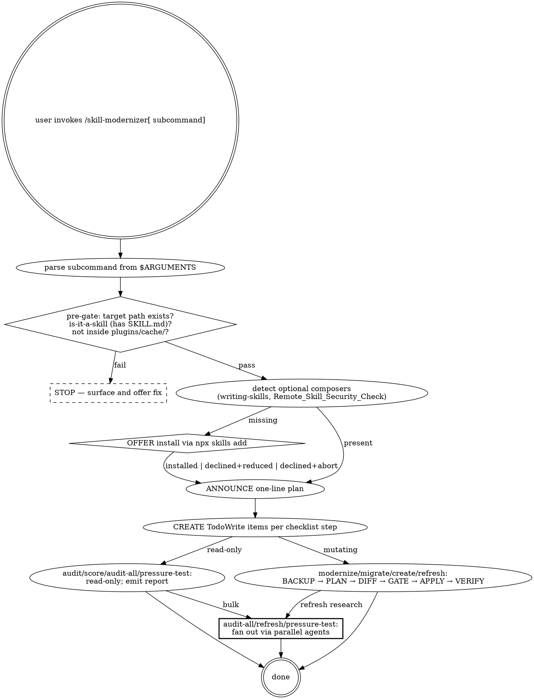

# skill-modernizer

A meta-skill for keeping agent skills high-quality, portable, and current. It ships a **Skill Quality Template** (10 patterns) and 8 subcommands that apply it.

> **Announce at start (every invocation):** "Using skill-modernizer to {subcommand} {target}."

---

## What this skill does

1. **Audits** existing skills against a 10-pattern checklist and emits a letter grade.
2. **Modernizes** skills that score below A by adding missing patterns (with diff preview + user gate).
3. **Creates** new skills via an archetype-aware wizard that pre-wires every pattern.
4. **Refreshes** the pattern catalog itself by researching canonical sources.
5. **Audits in bulk** with parallel agents, suitable for a whole `skills/` directory.

It is the only skill authorized to mutate its own `rules/pattern-catalog.md` and `rules/scoring-rubric.md` (via the `refresh` subcommand).

---

## Routing table — subcommands

| Subcommand | Type | Read/Write | One-line workflow |
|---|---|---|---|
| `audit <path>` | rigid | read-only | LOAD → SCAN → REPORT (checklist + letter grade) |
| `score <path>` | rigid | read-only | LOAD → SCAN → SCORE (grade only) |
| `modernize <path>` | rigid | mutating | BACKUP → AUDIT → PLAN → DIFF → GATE → APPLY → VERIFY |
| `migrate <path>` | rigid | mutating | BACKUP → DETECT → PLAN → DIFF → GATE → APPLY → VERIFY |
| `create <name>` | flexible | mutating | ARCHETYPE → WIZARD → SCAFFOLD → PRESSURE-TEST → REVIEW |
| `pressure-test <path>` | rigid | read-only (writes report) | DETECT-DEPS → SCENARIOS → REPORT |
| `refresh` | rigid | mutating | RESEARCH (parallel) → DIFF → GATE → APPLY → VERIFY |
| `audit-all [scope]` | rigid | read-only | DISPATCH (parallel) → AGGREGATE → REPORT |
| `prune-backups [opts]` | rigid | mutating | INDEX → SELECT → CONFIRM → DELETE |

`audit`, `score`, `audit-all`, `pressure-test` are read-only and never gate. Mutating subcommands always require explicit user gate before any file change.

---

## Decision graph



---

## Pre-gate (every invocation)

Before any further action, verify:

1. **Target path exists.** If a path argument is required and missing or invalid, STOP and surface a clear error.
2. **Target is a skill.** A skill has at minimum a `SKILL.md` at its root. If the target is a directory without `SKILL.md`, surface this and stop (or, for `create`, confirm this is a new directory).
3. **Target is not inside a plugin cache.** Reject paths matching `*/plugins/cache/*` for any mutating subcommand. Suggest copy-to-personal-skills first.

If any check fails: report the failure plainly. Do not retry. Do not guess.

---

## Red Flags

These thoughts mean STOP. You are rationalizing.

- Editing the target skill's source files **without** running `audit` first to confirm the gap exists.
- Running `modernize` while the target's repo (if it has one) shows merge or rebase in progress.
- Marking `audit` as complete without both surfaces (checklist + grade) in the report.
- Using `git add .` or staging non-skill files in any target's repo.
- Auto-deleting any reference or rule file during `modernize` (always preserve; if obsolete, mark with disclaimer header).
- Running `create` and overwriting an existing skill directory without explicit user approval.
- Calling `pressure-test` PASS while any RED scenario was skipped (skipped ≠ failed; skipped means scenario didn't run).
- Modernizing a skill **inside** a plugin cache directory — caches are plugin-manager-owned; never mutate. Suggest copying to a personal skills directory first.
- Backup directory placed inside the skills directory — would register as a skill. **Always** outside the skills namespace.
- Auto-installing any composer skill (e.g., `superpowers:writing-skills`) without explicit user approval.
- Applying `refresh` findings without showing the diff first.
- Letting a parallel-agent failure during `audit-all` silently drop a skill from the report — failed batch must aggregate as `unknown`, never disappear.

---

## Rationalization Defense

| Excuse | Reality |
|---|---|
| "This skill is too small to need a decision graph" | If the workflow has > 1 branch, the graph helps. If it's truly one branch, label `single-purpose` archetype and the rubric won't penalize. |
| "Adding Red Flags will be redundant — it's a simple skill" | Red Flags catch reasoning failures, not workflow failures. Even simple skills have rationalization risks. |
| "I can audit by eye, faster than running audit" | The checklist catches blind spots. Eye-auditing your own skill is the worst case for honest assessment. |
| "User accepted the modernize plan, I can `git add .`" | The target's repo may have unrelated changes. Always stage by explicit path. |
| "TDD Iron Law from writing-skills doesn't apply to my skill" | The Iron Law applies to discipline-enforcing skills. If your skill enforces nothing, label `flexible`; rubric won't require TDD scenarios. |
| "I'll skip pressure-test after create — the scaffold is correct by construction" | Wizard fills templates; templates can have empty stubs. Always pressure-test post-scaffold. |
| "The plugin-cache skill is what I want, I'll just edit it there" | Plugin cache is managed; edits are blown away on update. Copy to a personal skills directory first. |
| "I can install `writing-skills` without asking — the user will appreciate it" | Modifying user's environment without consent violates the discipline this skill enforces. Always offer + gate. |
| "audit-all is slow, let me run agents serially" | Serial wastes time and bloats context. Parallel dispatch is the correct pattern; it's why `rules/parallel-dispatch.md` exists. |
| "refresh found a new pattern; I'll just add it without showing the diff" | Diff preview is the gate. Skipping it for "obvious" findings is how rationalization compounds. |
| "Backup is taking up space; I'll skip it for fast-path subcommands" | Backups are insurance against mid-run failures, not just user reverts. Retention policy bounds disk; skipping is never the right answer. |

---

## TodoWrite atomic checklists

For each subcommand, create a TodoWrite item per phase **before** starting work. Mark `in_progress` when entering a phase, `completed` immediately on exit. Atomic. Never batch.

### Audit checklist

1. Pre-gate (path exists, is-a-skill, not in cache).
2. Load `rules/pattern-catalog.md`.
3. Detect archetype (read frontmatter + structure).
4. Scan target skill against each pattern.
5. Compute per-pattern letter using `rules/scoring-rubric.md`.
6. Compute overall letter.
7. Emit checklist + grade report.
8. Append entry to audit history JSONL.

### Modernize checklist

1. Pre-gate (path exists, not in cache, no in-progress git operation).
2. Detect optional composers; offer install if missing.
3. Run `audit` first.
4. Snapshot target to backup directory (outside skills namespace).
5. Index backup as `unverified`.
6. Compute proposed edits per `rules/edit-strategies.md`.
7. Render unified diff per affected file.
8. **GATE** — present diff to user, await explicit approval.
9. Apply edits via Edit/Write atomic operations.
10. Re-run `audit` against the post-apply state.
11. Bump skill `version` (minor).
12. Append history entry.
13. Mark backup as `verified`.

### Create checklist

1. Pre-gate (target name doesn't collide with existing skill).
2. Archetype selection via `AskUserQuestion`.
3. Wizard prompts (6-8 `AskUserQuestion` calls).
4. Scaffold full file tree from `rules/archetypes.md`.
5. Run `pressure-test` against scaffold.
6. Emit scaffold report + next-step suggestions.

### Refresh checklist

1. Detect optional composers.
2. Dispatch parallel research agents per `rules/research-sources.md`.
3. Aggregate findings.
4. Compute proposed diff against `rules/pattern-catalog.md` and `rules/scoring-rubric.md`.
5. **GATE** — present diff.
6. Apply on approval.
7. Bump `skill-modernizer` version (minor or patch depending on pattern impact).
8. Run self-`audit` to confirm new patterns pass on this skill.
9. Append history entry.

### Audit-all checklist

1. Pre-gate (scope path exists; resolve default to user skills directory).
2. Enumerate skills in scope.
3. Plan parallelism per `rules/parallel-dispatch.md`.
4. Dispatch one Explore subagent per batch.
5. Aggregate results; failed batches → `unknown`.
6. Emit per-skill checklist + cross-skill consistency findings.

---

## Backup module

Mutating subcommands (`modernize`, `migrate`, `create --overwrite`, `refresh`) snapshot the target before any edit.

**Backup location** (project-agnostic placeholder for the user's Claude config directory):

```
$CLAUDE_HOME/.backups/skill-modernizer/<skill-name>-<ISO-date>/
```

`$CLAUDE_HOME` resolves to the user's Claude config directory. The path is **always outside the skills namespace** — never inside any directory that the skill loader scans, so backups don't register as skills.

**Index** is appended to:

```
$CLAUDE_HOME/.backups/skill-modernizer/index.jsonl
```

Each line:

```jsonl
{"ts":"<ISO-timestamp>","skill":"<name>","subcommand":"<verb>","ver":"<semver>","path":"<backup-dir>","status":"unverified"}
```

After verify passes, status is updated to `verified` (write a new line; keep history append-only — never mutate prior lines).

**Retention policy:**
- Keep last **3 backups per skill** (sliding window).
- Plus **30-day TTL** — older snapshots pruned regardless of count.
- A `verified` backup younger than 30 days counts toward the 3-slot window.
- An `unverified` backup (mutation aborted mid-run) is kept for an additional 7 days then pruned.

Manual prune via `prune-backups`.

---

## Versioning

Every skill carries a `version:` field in frontmatter (semver).

- `create` defaults new skills to `0.1.0`.
- `modernize` bumps minor (`0.1.0 → 0.2.0`).
- `migrate` bumps major (`0.x.y → 1.0.0`) since structural changes are breaking.
- `refresh` bumps `skill-modernizer`'s own version (minor for additive pattern changes, patch for clarifications).

---

## Audit history

Append-only JSONL at:

```
$CLAUDE_HOME/.skill-modernizer/history.jsonl
```

Each entry:

```jsonl
{"ts":"<ISO-timestamp>","skill":"<name>","action":"audit|modernize|migrate|create|refresh","score":"<letter>","ver":"<semver>"}
```

`audit` and `audit --history <skill>` use this to surface trend lines.

---

## Composition with `superpowers:writing-skills`

**Detect:**

- Glob `$CLAUDE_HOME/plugins/cache/**/writing-skills/SKILL.md` AND `$CLAUDE_HOME/skills/writing-skills/SKILL.md`.
- If either matches, `writing-skills` is available.

**If installed:** `pressure-test` invokes its TDD Iron Law and RED/GREEN/REFACTOR sequence. `modernize` and `create` cite its Common Rationalizations table when extending the rationalization pattern. Use defensive section-heading parsing (regex by heading, not line numbers).

**If absent:**

```
This subcommand works best with `superpowers:writing-skills` installed.
Without it, pressure-test runs in reduced-rigor mode (skips Iron Law).

Install now?
  command: npx skills add obra/superpowers
  [y]es / [n]o / [r]educed-rigor mode
```

- On `y`: optionally invoke `Remote_Skill_Security_Check` first if installed; then run `npx skills add`. Retry the original subcommand.
- On `n`: abort current subcommand.
- On `r`: run with reduced-rigor flag set; report includes a banner.

`Remote_Skill_Security_Check` is composed similarly when `refresh` surfaces third-party skills as examples.

---

## Rule loading map (token-budgeted progressive disclosure)

This skill follows its own rules. SKILL.md loads no reference or rule file by default.

| File | ~tokens | Loaded by |
|---|---|---|
| `rules/pattern-catalog.md` | 1,400 | `audit`, `score`, `modernize`, `refresh` |
| `rules/scoring-rubric.md` | 800 | `audit`, `score`, `modernize` |
| `rules/archetypes.md` | 1,500 | `create` |
| `rules/edit-strategies.md` | 1,200 | `modernize`, `migrate` |
| `rules/migration-map.md` | 900 | `migrate` |
| `rules/scenario-catalog.md` | 1,300 | `pressure-test` |
| `rules/script-hygiene.md` | 700 | `audit` / `modernize` when target has `scripts/` |
| `rules/research-sources.md` | 600 | `refresh` |
| `rules/json-schema.md` | 500 | any subcommand with `--json` |
| `rules/parallel-dispatch.md` | 800 | `audit-all`, `refresh`, `pressure-test` (when scenarios independent) |
| `references/state-schema.md` | 600 | shared (state shape) |
| `references/skill-self-test.md` | 1,400 | self-reference; `pressure-test` |
| `references/subcommands/<name>.md` | ~700 each | matching subcommand only |
| `references/degradation-matrix.md` | 500 | when target has unusual structure |

Each subcommand reference declares its loads explicitly at the top.

---

## Provides

- **Skill Quality Template** — 10 patterns, portable across any skill ecosystem.
- **Letter-grade rubric** — archetype-aware A-F scoring.
- **JSON output schema** — stable schema for CI integration (`audit --json`, `score --json`, `audit-all --json`).
- **Audit history JSONL** — append-only event log other tools can consume.
- **Backup index** — append-only JSONL tracking backups by skill, date, and verification status.

## Consumes

- `superpowers:writing-skills` (optional) — TDD Iron Law and RED/GREEN/REFACTOR for `pressure-test`.
- `Remote_Skill_Security_Check` (optional) — security pre-check before installing remote skills.
- `find-skills` (optional) — referenced from `README.md` for users who want to discover other skills.

All optional dependencies are detected; missing ones trigger an offer-install flow with a reduced-rigor fallback.

---

## Self-test pointer

Pressure scenarios for this skill itself live in `references/skill-self-test.md`. Run `pressure-test $CLAUDE_HOME/skills/skill-modernizer/` (or wherever this skill is installed) to verify all scenarios pass.

---

## Quick reference

| Want to... | Run |
|---|---|
| Score a single skill quickly | `/skill-modernizer score <path>` |
| Get a full audit with checklist | `/skill-modernizer audit <path>` |
| Bring a skill up to standard | `/skill-modernizer modernize <path>` |
| Convert a legacy monolithic skill | `/skill-modernizer migrate <path>` |
| Start a new skill | `/skill-modernizer create <name>` |
| Stress-test a skill | `/skill-modernizer pressure-test <path>` |
| Refresh the pattern catalog | `/skill-modernizer refresh` |
| Audit all skills in a directory | `/skill-modernizer audit-all [scope]` |
| Prune old backups | `/skill-modernizer prune-backups` |
