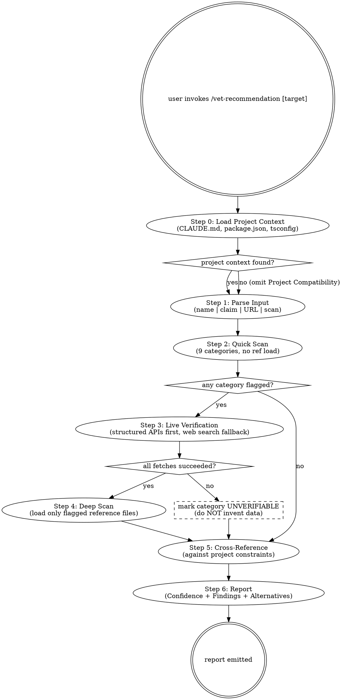

<!-- Last reviewed: 2026-05-07 -->

# Recommendation Vetting

Audit a tool, library, service, or technical claim for accuracy, security, and reputation before recommending or adopting it.

> **Announce at start (every invocation):** "Using vet-recommendation to vet {target}." State the target before any web fetch, registry call, or report-writing.

## Decision graph

Read top-down. Diamond nodes are decision points. Source data is fetched live; **never** invented when a fetch fails — see Red Flags below.



## When to Use

- User invokes `/vet-recommendation` with a target
- You are about to recommend a tool/service you haven't live-verified
- A previous recommendation was challenged or seems uncertain
- Evaluating a GitHub repo, npm package, or SaaS service for adoption
- Verifying a pricing, capability, or compatibility claim

## Input Parsing

Accepts these input forms:

| Input | Example | Parsed As |
|-------|---------|-----------|
| Tool/service name | `/vet-recommendation react-native-elements` | Search for tool, verify claims |
| Specific claim | `/vet-recommendation "Cartesia Sonic costs $2/1M characters"` | Verify the quoted claim |
| GitHub URL | `/vet-recommendation https://github.com/mixelpixx/SSH-MCP` | Audit the repository |
| No argument | `/vet-recommendation` | Scan current conversation for all recommendations, vet each |

When no argument is given, scan the conversation for tool/service recommendations you made and vet each one.

## Limited Context Strategy

This SKILL.md contains summary rules. Detailed verification guidance lives in `references/`. When a category flags during quick scan:

1. Identify which category needs deeper investigation
2. Load only that reference file from `~/.claude/skills/vet-recommendation/references/`
3. Follow its verification workflow

Loading one reference (~2-2.5K tokens) instead of everything saves significant context.

If any loaded reference file's `Last reviewed` date is >6 months old, warn the user: "Reference file [name] was last reviewed on [date] — some guidance may be outdated."

## Verification Workflow

### Step 0: Load Project Context

When running inside a project directory, gather constraints that affect compatibility:

1. Read `CLAUDE.md` (project root) — extract architecture, design system rules, hard constraints
2. Read `package.json` / `pyproject.toml` — extract deps, peer dep overrides, engine requirements
3. Read `tsconfig.json` — strict mode, path aliases, module resolution

Produce a **Project Constraints Summary** (used by Steps 2-6 and the report):

```
Framework: [e.g., Expo SDK 54 / React Native 0.81]
Styling: [e.g., NativeWind 4.2 — className prop required]
Accessibility: [e.g., 56dp touch targets, WCAG AAA, no opacity on disabled]
Runtime: [e.g., Hermes engine, iOS + Android]
Install: [e.g., --legacy-peer-deps required]
Hard constraints: [from CLAUDE.md design system rules]
Existing deps: [key deps that may conflict]
```

If no project context files are found: "No project context available — proceeding with generic vetting." Omit the Project Compatibility section from the report.

### Step 1: Parse Input

Identify the target: tool name, claim, URL, or conversation scan. Extract:
- **Subject**: What is being vetted (name, URL, claim text)
- **Context**: What project it's for (from Step 0 or conversation history)
- **Claim type**: Pricing, capability, security, general recommendation

### Step 2: Quick Scan

Check each category in the Summary Checklist below. No reference file loading yet — just flag categories that need deeper investigation.

### Step 3: Live Verification

Use structured APIs first, web search as fallback:

#### Preferred Data Sources

| Data Point | Primary Source | Fallback |
|------------|---------------|----------|
| Vulnerabilities | `POST https://api.osv.dev/v1/query` | `site:nvd.nist.gov` web search |
| Security score | `GET https://api.scorecard.dev/projects/github.com/OWNER/REPO` | GitHub Security tab |
| Downloads | `GET https://api.npmjs.org/downloads/point/last-month/PACKAGE` | npmjs.com web page |
| Package metadata | `GET https://registry.npmjs.org/PACKAGE` | npmjs.com web page |
| Dependency graph | `GET https://api.deps.dev/v3/systems/npm/packages/PACKAGE` | `npm ls` / `npm audit` |
| Bundle size | `GET https://bundlephobia.com/api/size?package=PACKAGE` | bundlephobia.com web page |
| GitHub stats | `gh api repos/OWNER/REPO` | GitHub web page |
| Pricing | Vendor pricing page (web fetch) | Web search |

All endpoints are public, no auth required.

### Step 4: Deep Scan

For any category that flagged in Step 2, load its reference file and follow the detailed verification patterns. Each reference file includes a **Project Context Cross-Check** section — apply it against the constraints from Step 0.

### Step 5: Cross-Reference

Compare findings against the project context from Step 0:
- Tech stack compatibility (framework, runtime, engine)
- Design system constraints (styling approach, accessibility rules)
- Dependency conflicts (peer deps, existing packages)
- Compliance requirements (HIPAA, SOC2, GDPR, etc.)
- Budget constraints if mentioned

### When Verification Fails

| Failure Mode | Action |
|--------------|--------|
| Web fetch returns empty/login-gated | Mark the category "UNVERIFIABLE — [reason]". Do not guess. |
| No GitHub repo found | Use registry metadata only. Flag: "Limited signal — no public repo." |
| Pricing is "Contact Sales" | State "Unverifiable." Cite community reports if any, with source. |
| API endpoint errors | Fall back to web search. Note fallback in Evidence column. |
| No package on registry | Search alternative registries. If none: "Not published on [registry]." |

**Hard rule:** Never invent data to fill a report field. If you cannot verify, say so.

### Step 6: Report

Output findings using the Report Template below.

## TodoWrite atomic checklist

For each invocation, create a TodoWrite item per step **before** starting work. Mark `in_progress` on entry, `completed` immediately on exit. Atomic. Never batch.

1. Load project context (Step 0).
2. Parse input target (Step 1).
3. Run quick scan across 9 categories (Step 2).
4. For each flagged category: live verification via structured API (Step 3).
5. For each flagged category: deep scan via reference file (Step 4).
6. Cross-reference findings against project constraints (Step 5).
7. Compute confidence using the Recommendation Rules.
8. Emit report from template (Step 6).

If a fetch fails for any step-4 category, add a follow-up todo "mark <category> UNVERIFIABLE" instead of merging it back into the parent todo. The split keeps the failure visible.

## Summary Checklist

| Category | Quick Scan For | Max Severity | Reference File |
|----------|---------------|--------------|----------------|
| Reputation | < 100 stars, single author, no commits in 6mo, archived | CRITICAL | `references/dependency-reputation.md` |
| Security | Known CVEs, security advisories, breach mentions | CRITICAL | `references/security-vulnerabilities.md` |
| Pricing | Unverified cost claims, training-data-only pricing | HIGH | `references/pricing-accuracy.md` |
| Capabilities | "native", "built-in" without verification, beta features | MEDIUM | `references/capability-verification.md` |
| Sources | No citation, training data only, outdated docs | MEDIUM | `references/source-attribution.md` |
| Compatibility | Version mismatches, OS requirements, compliance | HIGH | `references/compatibility-checks.md` |
| Bias | No alternatives presented, familiarity-only pick | LOW | `references/recommendation-bias.md` |
| Edge Cases | Recent acquisition, license change, active incident | HIGH | `references/edge-cases.md` |
| AI/ML Tools | Model deprecation, SDK instability, AI lock-in, streaming | HIGH | `references/ai-ml-evaluation.md` |

## Reference Files

| When You Need | File | ~Tokens |
|---------------|------|---------|
| Repo stats, adoption, abandonment, bus factor, typosquatting, longevity | `dependency-reputation.md` | 1,550 |
| CVE lookup, advisories, breach history, supply chain, OpenSSF Scorecard | `security-vulnerabilities.md` | 1,600 |
| Cost verification, unit confusion, hidden costs, AI pricing traps | `pricing-accuracy.md` | 1,800 |
| Native vs external, beta vs GA, deprecation, marketing vs reality | `capability-verification.md` | 1,900 |
| Citation quality, training data vs live, version mismatch | `source-attribution.md` | 1,750 |
| Version, OS, runtime, compliance, mobile, bundle size | `compatibility-checks.md` | 2,400 |
| Alternatives, fit for purpose, vendor lock-in, mandatory comparison | `recommendation-bias.md` | 1,850 |
| License bait-and-switch, acquisitions, incidents, name collision | `edge-cases.md` | 2,300 |
| Model deprecation, SDK stability, AI lock-in, streaming, data handling | `ai-ml-evaluation.md` | 2,300 |

## On-Demand Reference Loading

Reference files live at `~/.claude/skills/vet-recommendation/references/`. **Only read a reference file when the quick scan flags that category.** This keeps context lean — do not pre-load all reference files.

When a quick-scan flag is found, read the corresponding reference file for:
- Detailed verification workflows with specific searches to run
- Severity classification guidance (CRITICAL -> LOW)
- False positive indicators
- Common anti-patterns
- Project Context Cross-Check (apply against Step 0 constraints)

If any loaded reference file's `Last reviewed` date is >6 months old, warn the user.

## Confidence Scoring

| Level | Criteria |
|-------|----------|
| **HIGH** | All categories PASS with live-verified sources |
| **MODERATE** | Minor flags (MEDIUM findings) but no blockers |
| **LOW** | Significant flags (HIGH findings), use with caution |
| **INSUFFICIENT DATA** | Could not verify key claims, OR 2+ categories UNVERIFIABLE, OR any CRITICAL-capable category UNVERIFIABLE — do not recommend without manual verification |
| **FAIL** | CRITICAL findings — do not use |

## Report Template

```markdown
# Recommendation Vetting: [tool/service name]

## Confidence: [HIGH / MODERATE / LOW / INSUFFICIENT DATA / FAIL]

## Project Compatibility
<!-- Omit this section if Step 0 found no project context -->

- **Framework fit**: [compatible / incompatible / partial — details]
- **Design system**: [meets constraints / conflicts — details]
- **Dependency conflicts**: [none / list conflicts]
- **Install compatibility**: [standard / requires flags — details]

## Findings

| Category | Status | Severity | Evidence |
|----------|--------|----------|----------|
| Reputation | PASS / WARN / FAIL | — / MEDIUM / HIGH / CRITICAL | [details + source URL] |
| Security | PASS / WARN / FAIL | — / MEDIUM / HIGH / CRITICAL | [details + source URL] |
| Pricing | PASS / WARN / FAIL | — / MEDIUM / HIGH | [details + source URL] |
| Capabilities | PASS / WARN / FAIL | — / LOW / MEDIUM | [details + source URL] |
| Sources | PASS / WARN / FAIL | — / LOW / MEDIUM | [details + source URL] |
| Compatibility | PASS / WARN / FAIL | — / MEDIUM / HIGH | [details + source URL] |
| Bias | PASS / WARN / FAIL | — / LOW | [details + source URL] |
| Edge Cases | PASS / WARN / FAIL | — / MEDIUM / HIGH | [details + source URL] |
| AI/ML Tools | PASS / WARN / FAIL / N/A | — / MEDIUM / HIGH | [details + source URL] |

## Verified Claims

- [claim] -> Verified / Unverifiable / Contradicted ([source URL])

## Alternatives (Required)

| Criterion | [Recommended] | [Alternative A] | [Alternative B] |
|-----------|--------------|-----------------|-----------------|
| Fits primary requirement | Yes/Partial/No | Yes/Partial/No | Yes/Partial/No |
| Adoption/maturity | [stats] | [stats] | [stats] |
| Cost | [verified] | [verified] | [verified] |
| Lock-in risk | Low/Med/High | Low/Med/High | Low/Med/High |
| Key trade-off | [detail] | [detail] | [detail] |

## Longevity Assessment

- **Release cadence**: [e.g., monthly / quarterly / stalled]
- **Contributor trend**: [growing / stable / declining]
- **Breaking change frequency**: [majors in last 12mo]
- **Migration path if abandoned**: [alternatives, data portability, blast radius]

## Data Gaps

- [What couldn't be verified and why]

## Recommendation

[Use / Use with caution / Do not use / Insufficient data to recommend]

[One paragraph explaining the recommendation with key evidence]
```

## Recommendation Rules

- Any **CRITICAL** finding -> Confidence: FAIL. Recommendation: Do not use.
- Any **HIGH** finding (no CRITICAL) -> Confidence: LOW. Recommendation: Use with caution, cite the HIGH finding(s).
- Only **MEDIUM** findings -> Confidence: MODERATE. Recommendation: Use, note the findings.
- Only **LOW** or no findings -> Confidence: HIGH. Recommendation: Use.
- Cannot verify key claims -> Confidence: INSUFFICIENT DATA. Recommendation: Do not recommend without manual verification.
- 2+ categories UNVERIFIABLE, or any CRITICAL-capable category (Reputation, Security) UNVERIFIABLE -> Confidence: INSUFFICIENT DATA.

## Red Flags

These thoughts mean STOP. You are rationalizing.

- **"I remember this package from training data — I can skip the live fetch."** Training data is stale by months to years. Pricing, CVEs, and stars all drift. Always fetch live.
- **"The fetch failed; let me estimate the star count from what I recall."** Estimating data after a failed fetch is fabricating. Mark UNVERIFIABLE; never invent.
- **"The vendor's pricing page is gated behind login — I'll cite the marketing blog instead."** Marketing content is not pricing. Mark Pricing UNVERIFIABLE; community reports are acceptable only with source URLs.
- **"Capabilities looked fine in quick scan — I can skip the deep scan reference."** Quick scan is presence-only. The reference file's anti-patterns and false-positive indicators catch things the surface check misses.
- **"I'll skip the Alternatives section — the user picked this one."** Alternatives is a required field per the template. Omitting it hides lock-in and bias risk; the rubric depends on it.
- **"This is just a pricing claim, I don't need the Project Constraints Summary."** Pricing claims interact with budget constraints in CLAUDE.md. Always run Step 0 when in a project directory.
- **"Two categories are UNVERIFIABLE but the rest are clean — confidence MODERATE."** The Recommendation Rules force INSUFFICIENT DATA at 2+ UNVERIFIABLE. Don't soften the verdict.
- **"The reference file says `Last reviewed` 9 months ago, but the guidance still looks right."** The staleness warning is for the user, not your filter. Surface it explicitly in the report.
- **"AI/ML category doesn't apply, I'll just delete the row."** The template uses `N/A` for inapplicable. Deleting rows breaks downstream consumers reading the structured table.

## Rationalization Defense

| Excuse | Reality |
|---|---|
| "I know this package, fetching is overkill" | Training data has no timestamp guarantee. A package you "know" may have been deprecated, acquired, or had a CVE published since cutoff. Live fetch is the only verifier. |
| "The API returned 500 — I'll fall back to my memory" | Fallback is documented as web search, not memory. Memory in this skill = fabrication. UNVERIFIABLE is the correct outcome of a failed fetch. |
| "The user just wants a quick answer, not all 9 categories" | The 9 categories exist because each has surfaced real failures. Skipping them produces a confident-sounding report with hidden gaps — worse than a slow honest one. |
| "Pricing is `$X/month` per the marketing page, that's verified" | Marketing pages publish list price; actual price requires the official pricing page. If the pricing page is gated, mark UNVERIFIABLE. |
| "Only 1 category UNVERIFIABLE, that's still HIGH confidence" | Confidence Scoring requires *all* categories PASS for HIGH. One UNVERIFIABLE drops to MODERATE at best, INSUFFICIENT DATA if the unverified one is Reputation or Security. |
| "Alternatives is busywork, I already know the recommendation" | Alternatives prevents familiarity bias and surfaces lock-in. Skipping it is the bias the skill exists to defeat. |
| "The skill doesn't apply when I'm just answering a question" | Any time you recommend a tool, library, or service in your output, this skill applies. The CLAUDE.md guardrail says self-trigger; don't wait to be asked. |

## Provides

- **Vetting report schema** — `# Recommendation Vetting:` heading + standardized sections (Confidence, Project Compatibility, Findings table, Verified Claims, Alternatives, Longevity, Data Gaps, Recommendation). Other skills can grep for these section headers.
- **9-category taxonomy** — Reputation, Security, Pricing, Capabilities, Sources, Compatibility, Bias, Edge Cases, AI/ML — stable category names usable as keys in downstream automation.
- **Confidence levels** — `HIGH | MODERATE | LOW | INSUFFICIENT DATA | FAIL` — stable enum.
- **Severity scale** — `CRITICAL | HIGH | MEDIUM | LOW` mapped 1:1 to category max severities in Summary Checklist.

## Consumes

- `Read` — load project context files and reference markdown.
- `WebFetch` — vendor pricing pages, GitHub web pages, npmjs.com, NIST/OSV.
- `WebSearch` — fallback for blocked or login-gated sources.
- `Bash` — `gh api`, `npm view`, registry curl calls.
- `AskUserQuestion` — only when the input is ambiguous (e.g., name collision between two real packages).
- `references/*.md` (this skill's own bundle) — loaded only when the corresponding category flags.
- **CLAUDE.md** (project) — read in Step 0 to extract design-system and budget constraints.
- **`Remote_Skill_Security_Check`** (optional) — composable: when vetting a remote skill (`npx skills add ...`), invoke it before recommending install.

## Self-test pointer

Pressure scenarios for this skill live in `references/skill-self-test.md`. Run `/skill-modernizer pressure-test ~/.claude/skills/vet-recommendation` to verify all scenarios pass.
